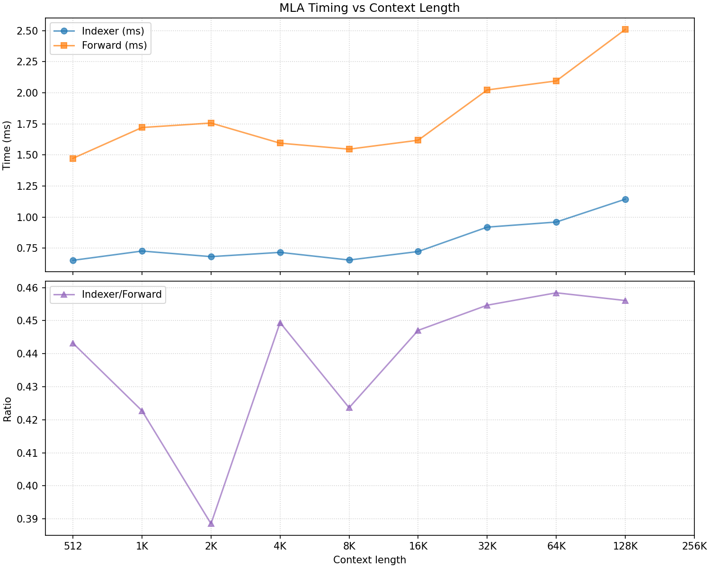
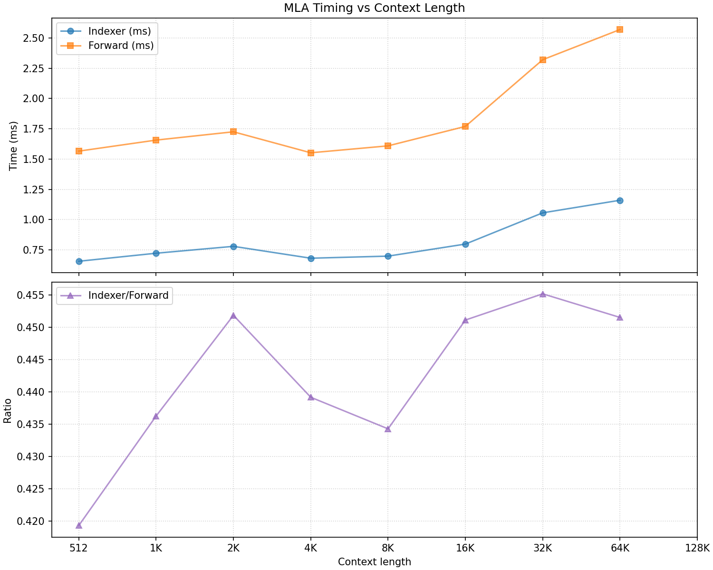

# DeepSeek Sparse Attention (DSA) 性能测试报告

## 1. 测试背景
本次测试旨在评估 DeepSeek-V3.2 模型中 DSA (DeepSeek Sparse Attention) 模块的性能表现，并分析 `lightning-indexer` 在整个模块中的耗时占比。

## 2. 测试环境
| 配置项 | 值 |
| :--- | :--- |
| VLLM 版本 | `0.11.1rc2.dev103+g17c540a99.precompiled` |
| Lightning Indexer 实现 | `DeepGEMM v2.1.0+594953a` |
| Tensor Parallel Size | 1 |
| 测试方法 | VLLM Eager 模式（不包含 CPU 开销） |
| 评测范围 | 完整的 Attention 模块（包含 `qkv_proj` 和 `o_proj`） |
| 测试场景 | 单 Token Decode |
| 序列长度范围 | 512 至 128k |

## 3. 测试结果

### 3.1 Batch Size = 1
下图展示了 Batch Size 为 1 时的测试结果。其中，`Forward` 曲线代表整个 DSA 模块的端到端运行时间。从图中可以看出，随着序列长度的增加，`lightning-indexer` 的耗时在整个 Attention 模块中的占比稳定在 40% 至 45% 之间。



### 3.2 Batch Size = 2
下图展示了 Batch Size 为 2 时的测试结果。由于显存限制，本次测试的最大序列长度为 64k。与 Batch Size 为 1 的场景类似，`lightning-indexer` 的耗时占比同样稳定在 40% 至 45% 的范围内。



## 4. 结论
综合测试结果，在单 Token Decode 场景下，`lightning-indexer` 是 DSA 模块中的一个主要性能开销点，其耗时约占整个模块的 40% 至 45%。

## 5. 附录

### 5.1 关于未使用 `torch.compile` 的说明
本次测试选择在 VLLM 的 Eager 模式下进行。这是因为 `torch.compile` 会将 Python 层的操作编译为底层 CUDA Kernel，导致原始操作的名称和执行顺序发生变化，难以精确地将耗时与源码中的具体操作对应起来，容易引入测量误差。为保证计时结果的准确性，故采用 Eager 模式。

### 5.2 核心测试代码
计时部分代码如下：
```python
class MultiHeadLatentAttentionWrapper(CustomOp):
    def forward_native(
        self,
        positions: torch.Tensor,
        hidden_states: torch.Tensor,
    ) -> torch.Tensor:
        # Measure total forward time on CUDA (required)
        assert hidden_states.is_cuda, "MLA forward must run on CUDA tensors"
        total_start_event = torch.cuda.Event(enable_timing=True)
        total_end_event = torch.cuda.Event(enable_timing=True)
        total_start_event.record()

        ...

        if self.indexer and self.is_sparse:
            index_start_event = torch.cuda.Event(enable_timing=True)
            index_end_event = torch.cuda.Event(enable_timing=True)
            index_start_event.record()
            _topk_indices = self.indexer(hidden_states, q_c, positions,
                                         self.rotary_emb)
            index_end_event.record()

        attn_out = self.mla_attn(
            q,
            kv_c_normed,
            k_pe,
            output_shape=(hidden_states.shape[0],
                          self.num_heads * self.v_head_dim),
        )

        out = self.o_proj(attn_out)[0]

        total_end_event.record()
        torch.cuda.synchronize(hidden_states.device)
        index_ms = index_start_event.elapsed_time(index_end_event)
        total_ms = total_start_event.elapsed_time(total_end_event)
        logger.info("%s.mla.indexer_ms=%.3f", self.prefix, index_ms)
        logger.info("%s.mla.forward_ms=%.3f", self.prefix, total_ms)

        return out
```

LLM 初始化代码如下：
```python
llm = LLM(
    model=model_path,
    trust_remote_code=True,
    max_model_len=max_model_len,
    gpu_memory_utilization=0.30,
    max_num_seqs=max(batch_sizes),
    enforce_eager=True,
)
```

<!-- ### 5.3 DSA 模块各阶段算子分析
| 阶段 | Kernel 名称 | 描述 |
| :--- | :--- | :--- |
| QKV Projection | `nvjet_tst_256x8_64x6_2x1_v_bz_TNT` | QKV线性投影 (GEMM) |
| Indexer - Step 1 | `fp8_paged_mqa_logits` | 计算 Q × K^T logits (从paged KV cache) |
| Indexer - Step 2 | `topKPerRow` | 从logits中选择Top-K索引 |
| Index Conversion | `_convert_req_index_to_global_index_kernel` | 将请求级索引转换为全局索引 |
| Tensor Ops | `CatArrayBatchedCopy` | 张量拼接 (KV nope + pe) |
| KV Cache | `concat_and_cache_mla_kernel` | 将KV写入cache |
| Sparse Attention | `sparse_attn_fwd_kernel` | 稀疏注意力计算（使用预计算的TopK索引） |
| Output Projection | `nvjet_tst_128x8_64x12_1x1_v_bz_NNT` | 输出投影 (GEMM) | -->
