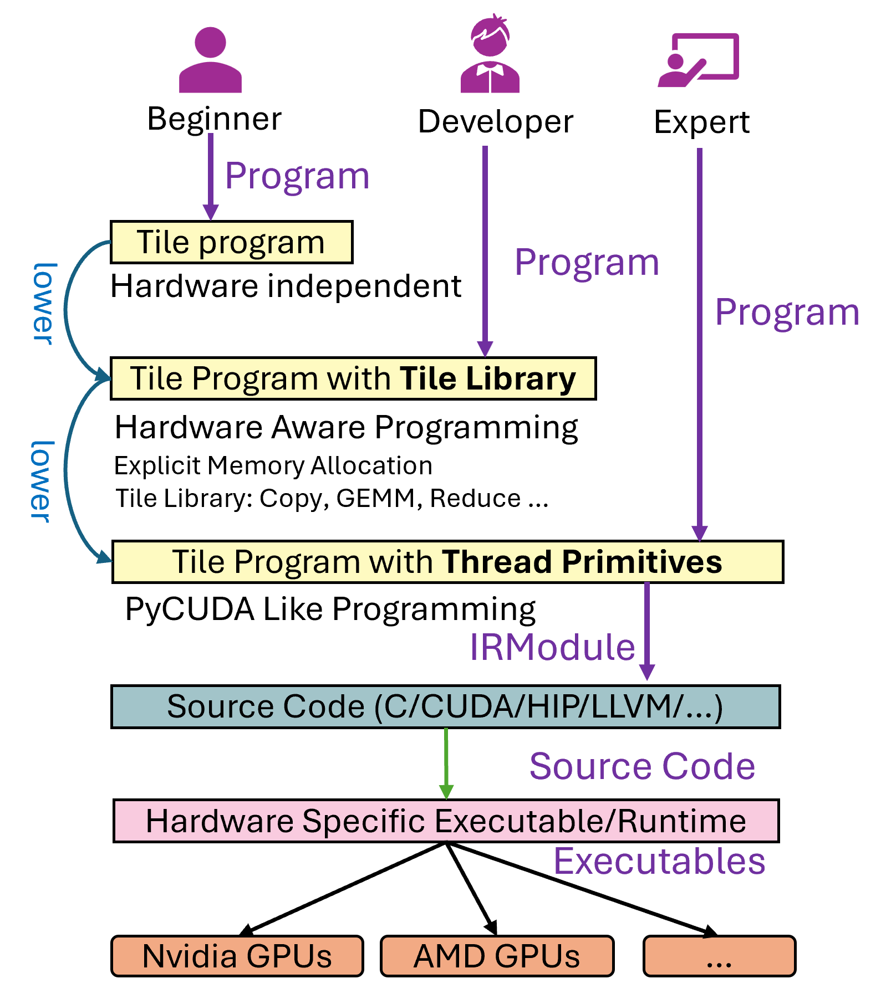
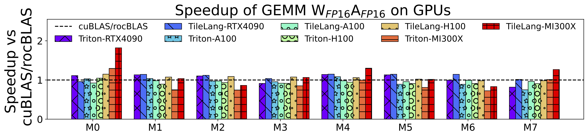
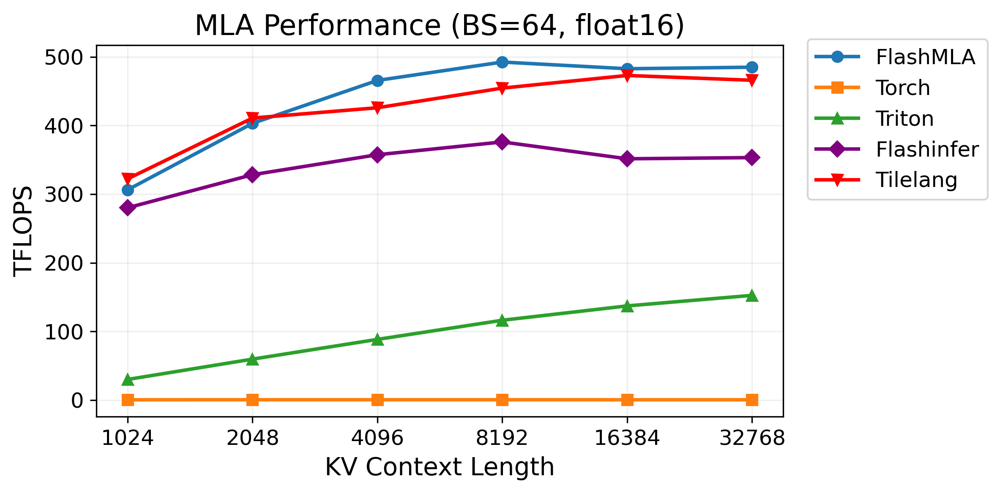
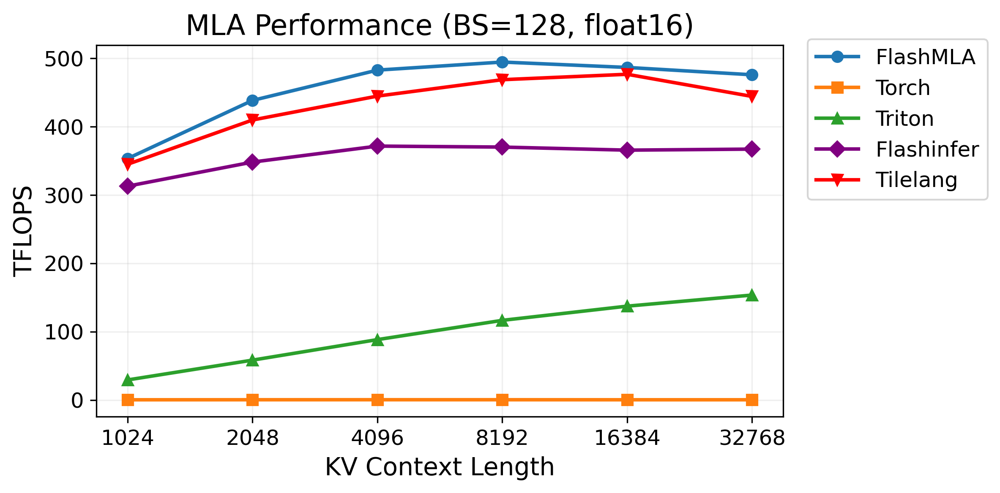

# TileLang 与 Triton 全方位对比调研

## 引言

随着 AI 模型的复杂度日益增长，手写优化的高性能计算内核成为发掘硬件潜力的关键。TileLang 与 Triton 作为两种前沿的领域专用语言（DSL），均致力于简化 GPU 高性能编程，但它们在设计哲学、性能优化策略及生态系统方面存在显著差异。本报告将对二者进行深入的对比分析，旨在为不同应用场景下的技术选型提供参考。

## 核心观点

TileLang 和 Triton 的核心目标都是简化高性能 GPU 编程，但其设计理念、优化策略和生态定位各有侧重。

**Triton** 的核心优势在于其**极致的易用性**和与 Python 生态的**无缝集成**。它通过高层抽象隐藏了底层硬件的复杂性，使开发者能以接近 Python 的编程效率，获得媲美甚至超越手动优化 CUDA 的性能，尤其在与 PyTorch 等主流深度学习框架结合时表现出色。

**TileLang** 则在设计上更进一步，其**“调度与数据流解耦”**的核心理念，在提供高层次抽象的同时，保留了开发者对数据流和内存布局的**显式控制能力**。这种设计使其在性能上展现出超越 Triton 的潜力，**特别是在支持国产 AI 芯片方面，具有独特的战略价值**。

### 适用场景对比

**Triton 适用场景：**
*   **追求极致开发效率**：快速实现并验证新的模型算子。
*   **快速原型验证**：简化 GPU 编程，缩短研究周期。
*   **与主流框架深度集成**：受益于 PyTorch 2.0 等框架的内置支持。
*   **跨平台兼容性**：在 NVIDIA 和 AMD 等主流硬件上获得良好支持。

**TileLang 适用场景：**
*   **追求极致性能**：对关键算子进行深度优化，压榨硬件极限。
*   **需要深度硬件调优**：手动控制数据流、内存层次和流水线。
*   **构建自主可控 AI 生态**：为国产硬件提供高性能计算基础。
*   **支持国产 AI 芯片**：对昇腾等国产芯片提供适配支持。

### 硬件支持

- **Triton**: 支持 NVIDIA CUDA 和 AMD ROCm。
- **TileLang**: 除支持 NVIDIA 和 AMD 外，还额外支持华为昇腾（Ascend）。

值得注意的是，TileLang 对国产芯片的适配并非易事，其主仓库（[`tile-ai/tilelang`](https://github.com/tile-ai/tilelang)）和昇腾适配仓库（[`tile-ai/tilelang-ascend`](https://github.com/tile-ai/tilelang-ascend)）是分离的，这反映了其在底层硬件适配上投入的深度。

## 核心设计理念与抽象层次

共同点：
1. 都是基于tile的编程语言
2. 都可以自动进行资源调度和性能调优

TileLang和Triton作为两种前沿的高性能计算编程语言，虽然目标均为简化GPU内核开发，但其背后的设计哲学与抽象层次存在根本性差异。这些差异决定了它们各自的适用场景、性能潜力以及学习曲线。Triton的核心设计理念是“可访问性”与“通用性”，而TileLang则追求“硬件感知”与“极致性能”。

Triton的首要目标是降低研究人员编写高效自定义GPU内核的门槛。编译器负责将这些tile映射到硬件线程、warp、张量核心等资源上，并自动y优化内存合并、shared memory优化和指令调度等高级优化，这种高层抽象极大地提升了开发效率。
Triton的抽象层级相对统一，允许用户控制分块参数（如`BLOCK_SIZE_M`等），但通常不需要关心底层的线程同步细节或寄存器分配。

相比之下，TileLang的设计理念更侧重于“让开发者专注于计算逻辑，而非硬件细节，同时不牺牲性能”。
它旨在弥合高层框架（如PyTorch）与手写汇编之间的鸿沟，提供一种既能保持开发效率又具备强大底层控制能力的语言。为此，TileLang构建了一个三层次的抽象系统:
1. 第一层是全自动调度，类似于TVM，完全由编译器决定所有优化策略。
2. 第二层是半自动调度，允许用户控制分块（tiling）和并行化的宏观层面，但无需处理具体的线程、warp或寄存器管理，这在功能上与Triton最为相似
3. 第三层则是完全的手工控制，接近于直接编写CUDA或HIP内核，为专家级用户提供终极的灵活性



如上图所示，这种多层次的设计赋予了TileLang巨大的灵活性，使其既能像Triton一样快速原型设计，也能像手写代码一样进行精细调优


这两种设计哲学的差异体现在API和编程模式上。Triton的编程体验更简单直观，例如使用`@triton.jit`装饰器将Python函数转化为GPU内核，并通过`tl.load`和`tl.store`进行内存读写。它的自动调优机制（`@triton.autotune`）进一步自动化了性能优化过程。

TileLang则提供了更多显式的原语来指导编译器。例如，`T.Pipelined`用于手动创建流水线以重叠内存传输与计算，`T.use_swizzle`用于提升L2缓存命中率，`T.gemm`则直接调用底层的GEMM指令。开发者可以明确地为共享内存和寄存器片段分配空间（`T.alloc_shared`, `T.alloc_fragment`）

| 特性             | Triton                                                          | TileLang                                                                       |
| :--------------- | :-------------------------------------------------------------- | :----------------------------------------------------------------------------- |
| **核心设计哲学** | 简化GPU编程，降低CUDA专业知识需求，强调易用性和通用性           | 专注于高性能，通过多层级抽象平衡易用性与底层控制力，减少开发者对硬件细节的关注 |
| **抽象层级**     | 统一的高层SPMD模型，通过参数调整进行优化                        | 三层抽象：全自动、半自动（类似Triton）、全手工控制（接近手写CUDA/HIP）         |
| **编程范式**     | Python DSL，使用装饰器（`@triton.jit`）定义内核，支持组合式编程 | Python DSL，提供显式原语（`T.Pipelined`, `T.gemm`）进行控制，支持组合式编程    |
| **开发者角色**   | 编写计算逻辑，编译器负责大部分优化决策 。                       | 编写计算逻辑的同时，通过注解和原语引导编译器生成最优代码。                     |


## 性能对比

在性能方面，TileLang和Triton均展示了各自的优势，但其表现高度依赖于具体的应用场景、算子类型和硬件架构。总体而言，TileLang在需要深度硬件感知和精细化控制的场景下，尤其是在较新的NVIDIA Hopper和AMD MI300X GPU上，展现出显著的性能优势。而Triton则在通用场景下提供了卓越的开箱即用性能和跨平台兼容性。

### GEMM
经充分调优（如使用自动调参器）后，TileLang 在多款 GPU 上可达到乃至超越厂商库与 Triton 的性能。在TileLang内部的 FP16 矩阵乘法测试中（RTX 4090、A100、H100、MI300X），TileLang 表现如下图所示：
- RTX 4090：约比 cuBLAS 快 1.1 倍
- A100：约达 cuBLAS 的 0.97 倍（基本持平）
- H100：约与 cuBLAS 持平（1.0 倍）
- MI300X：约比 cuBLAS 快 1.04 倍
相较 Triton，TileLang 的提速幅度在 1.08–1.25 倍之间，具体取决于硬件平台。
实际数值会因分块大小、流水线级数及硬件特性而有所波动。



### FlashMLA
真正的性能差距体现在更复杂的、非标准的算子上。在FlashMLA实现中，TileLang仅用80行Python代码便实现了与手写汇编内核相当的性能，在NVIDIA Hopper和AMD MI300X上，其性能分别比Triton快1.98倍和3.76倍。
如下图所示，在H100上，TileLang实现的MLA算子性能达到了FlashMLA的约95%，而Triton的实现性能则远低于此。






在一项NSA（Nested Sparse Attention）的性能测试中，初始状态下Triton在H20和A100上的表现优于TileLang。但经过社区优化后，TileLang通过启用自动TMA调整和避免小尺寸TMA开销等措施，最终反超Triton，实现了更快的执行速度。

当算子的性能瓶颈在于非标准的内存访问模式、稀疏计算或需要复杂的流水线调度时，TileLang提供的更强控制力能够转化为更好的性能


## 生态系统

在易用性、生态系统和跨平台支持方面，Triton凭借其先发优势和OpenAI的强大背书，目前拥有更广泛的接受度和更完善的生态。
Triton已经成为学术界和工业界研究和实验的首选工具之一，Triton已被集成到主流框架中，例如
- [PyTorch 2.0的TorchInductor编译器就使用Triton来生成融合内核](https://docs.pytorch.org/docs/stable/torch.compiler_inductor_profiling.html)
- [Unsloth.ai的LLM训练库也利用Triton获得了显著的速度提升](https://www.linkedin.com/posts/arazvant_the-hardware-agnostic-language-for-gpu-programming-activity-7343231719333900289-C0Ei/)


且社区围绕Triton形成了丰富的扩展，如[Triton-distributed](https://arxiv.org/pdf/2504.19442)，它支持细粒度的计算与通信重叠，在分布式系统中取得了超越手写优化代码的性能。[Triton BENCH](https://github.com/triton-foundation/tritonbench)等工具也为评估LLM生成中的Triton算子提供了支持


TileLang的生态系统尚处于发展初期。截至2025年10月11日，它在GitHub上已有3.4k个star（昇腾版本仅100+个star），比triton有17.2k个star。
因此，与Triton相比，tilelang的社区规模、第三方集成和支持的文档数量都还有很大差距


## 代码示例分析
下面两段代码分别展示了 `fp8_gemm` 的 TileLang 和 Triton 实现。其中，TileLang 采用的是其第二层抽象（半自动调度），这一层级与 Triton 的抽象程度最为接近。

通过对比，我们可以忽略语法细节上的差异，聚焦于两者在编程模型和逻辑上的核心区别：

1.  **内存层次的显式控制**：TileLang 允许开发者通过 `alloc_shared`（共享内存）和 `alloc_fragment`（寄存器）等原语，精确控制数据的存放位置。而 Triton 将这些决策完全交给编译器自动处理，不提供此类接口。
2.  **数据布局的优化能力**：TileLang 提供了 `T.use_swizzle` 这样的接口，让开发者可以手动启用数据重排（swizzling）来优化缓存利用率。在 Triton 中，这类优化同样由编译器自动完成。
3.  **数据组织与索引方式**：TileLang 的编程模型完全基于“Tile”（数据块）构建，开发者通过 Tile 索引进行操作，无需关心底层的物理内存地址。相比之下，Triton 的模型更接近底层 CUDA，需要开发者显式获取线程 ID（`program_id`），并手动计算内存偏移量来访问数据。

```python
@tilelang.jit(pass_configs=pass_configs)
def fp8_gemm_kernel(N, K, out_dtype=BF16, accum_dtype="float32"):
    assert out_dtype in [BF16, "float32"]

    M = T.symbolic("M")
    group_size = 128
    block_M = 32
    block_N = 128
    block_K = 128

    @T.prim_func
    def fp8_gemm_kernel_(
        A: T.Tensor[(M, K), FP8],
        B: T.Tensor[(N, K), FP8],
        C: T.Tensor[(M, N), out_dtype],
        scales_a: T.Tensor[(M, T.ceildiv(K, group_size)), FP32],
        scales_b: T.Tensor[(T.ceildiv(N, group_size), T.ceildiv(K, group_size)), FP32],
    ):
        with T.Kernel(T.ceildiv(N, block_N), T.ceildiv(M, block_M), threads=128) as (
            bx,
            by,
        ):
            A_shared = T.alloc_shared((block_M, block_K), FP8)
            B_shared = T.alloc_shared((block_N, block_K), FP8)
            C_shared = T.alloc_shared((block_M, block_N), out_dtype)
            Scale_C_shared = T.alloc_shared((block_M), FP32)
            C_local = T.alloc_fragment((block_M, block_N), accum_dtype)
            C_local_accum = T.alloc_fragment((block_M, block_N), accum_dtype)

            # Improve L2 Cache
            T.use_swizzle(panel_size=10)

            T.clear(C_local)
            T.clear(C_local_accum)
            K_iters = T.ceildiv(K, block_K)
            for k in T.Pipelined(K_iters, num_stages=4):
                # Load A into shared memory
                T.copy(A[by * block_M, k * block_K], A_shared)
                # Load B into shared memory
                T.copy(B[bx * block_N, k * block_K], B_shared)
                # Load scale into shared memory
                Scale_B = scales_b[bx * block_N // group_size, k]
                for i in T.Parallel(block_M):
                    Scale_C_shared[i] = scales_a[by * block_M + i, k] * Scale_B

                T.gemm(A_shared, B_shared, C_local, transpose_B=True)
                # Promote to enable 2xAcc
                for i, j in T.Parallel(block_M, block_N):
                    C_local_accum[i, j] += C_local[i, j] * Scale_C_shared[i]
                T.clear(C_local)
            # TMA store
            T.copy(C_local_accum, C_shared)
            T.copy(C_shared, C[by * block_M, bx * block_N])

    return fp8_gemm_kernel_
```


对应的Triton版本代码示例如下：

```python
@triton.jit
def fp8_gemm_kernel(
    A_ptr, B_ptr, C_ptr,
    scales_a_ptr, scales_b_ptr,
    M, N, K,
    stride_am, stride_ak,
    stride_bk, stride_bn,
    stride_cm, stride_cn,
    stride_scales_a_m, stride_scales_a_k,
    stride_scales_b_n, stride_scales_b_k,
    out_dtype: tl.constexpr,
    BLOCK_M: tl.constexpr, BLOCK_N: tl.constexpr, BLOCK_K: tl.constexpr,
    GROUP_SIZE_K: tl.constexpr,
):
    pid_m = tl.program_id(axis=0)
    pid_n = tl.program_id(axis=1)

    offs_m = pid_m * BLOCK_M + tl.arange(0, BLOCK_M)
    offs_n = pid_n * BLOCK_N + tl.arange(0, BLOCK_N)
    offs_k = tl.arange(0, BLOCK_K)

    a_ptrs = A_ptr + (offs_m[:, None] * stride_am + offs_k[None, :] * stride_ak)
    b_ptrs = B_ptr + (offs_k[:, None] * stride_bk + offs_n[None, :] * stride_bn)

    # Accumulator for the final result, in float32 for precision.
    accumulator = tl.zeros((BLOCK_M, BLOCK_N), dtype=tl.float32)

    for k in range(0, K, BLOCK_K):
        # Load blocks of A and B
        a = tl.load(a_ptrs, mask=(offs_m[:, None] < M) & (offs_k[None, :] < K - k), other=0.0)
        b = tl.load(b_ptrs, mask=(offs_k[:, None] < K - k) & (offs_n[None, :] < N), other=0.0)

        # Perform matrix multiplication on FP8 inputs.
        # The result is accumulated in int32.
        c_dot = tl.dot(a, b)

        # Load scales
        # scales_a is per-row of A
        k_scaled_idx = k // GROUP_SIZE_K
        scales_a_ptrs = scales_a_ptr + offs_m * stride_scales_a_m + k_scaled_idx * stride_scales_a_k
        scales_a = tl.load(scales_a_ptrs, mask=offs_m < M, other=0.0)
        
        # scales_b is per-tile of B
        scales_b_ptrs = scales_b_ptr + (pid_n * BLOCK_N // (GROUP_SIZE_K//2)) * stride_scales_b_n + k_scaled_idx * stride_scales_b_k
        scales_b = tl.load(scales_b_ptrs) # A single scalar value

        # Apply scaling and accumulate
        accumulator += c_dot.to(tl.float32) * scales_a[:, None] * scales_b

        a_ptrs += BLOCK_K * stride_ak
        b_ptrs += BLOCK_K * stride_bk

    # Cast to output dtype
    if out_dtype == tl.bfloat16:
        accumulator = accumulator.to(tl.bfloat16)

    # Store the result
    c_ptrs = C_ptr + offs_m[:, None] * stride_cm + offs_n[None, :] * stride_cn
    tl.store(c_ptrs, accumulator, mask=(offs_m[:, None] < M) & (offs_n[None, :] < N))
```

## 总结

Triton 与 TileLang 代表了 GPU 编程语言发展的两种不同路径。

**Triton** 以其卓越的**易用性**和**强大的生态集成**，是当前学术界和工业界快速原型验证和通用算子实现的首选工具，但其只有一个抽象层次，不能进行精细的硬件调优，且需要开发者显式计算内存偏移量来做数据IO

**TileLang** 则通过其**分层抽象**和**对底层硬件的精准控制**，为追求极致性能的专家级用户提供了强大的武器。它有三个抽象层次，可以进行精细的硬件调优，性能通常比Triton更好，且不需要开发者显式计算内存偏移量来做数据IO。但其生态系统尚在发展，文档资料不足，学习曲线相对陡峭。但对国产芯片的支持未来可期

