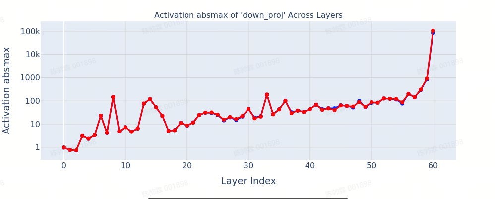
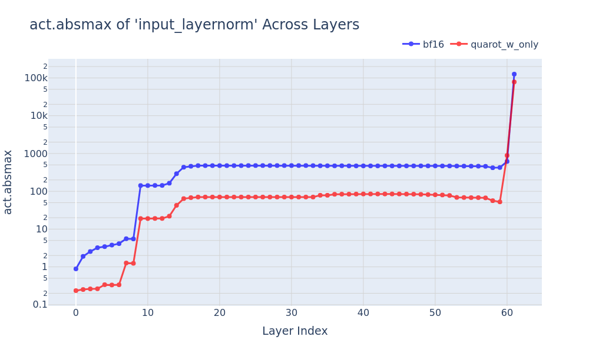
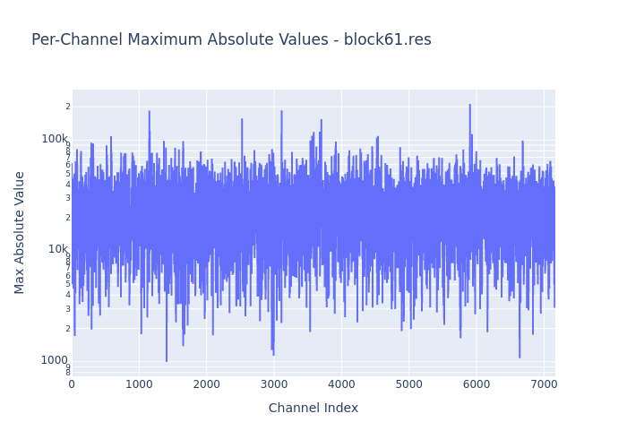
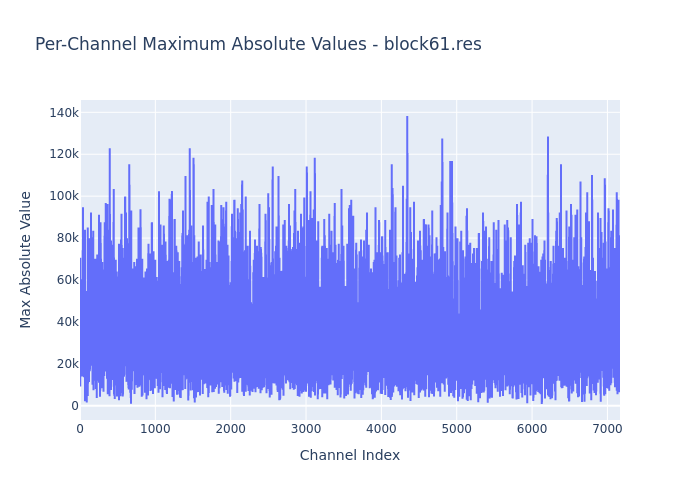
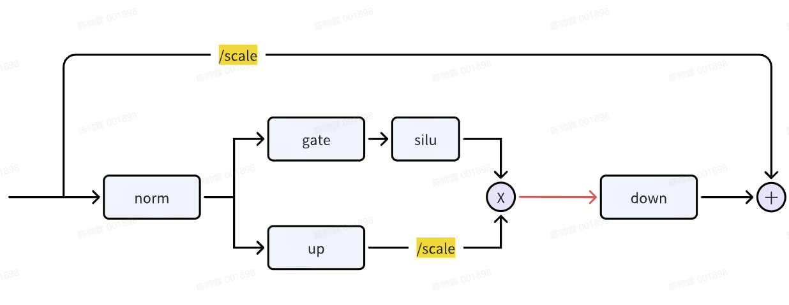

# DeepSeek R1 FP16部署踩坑实录

## 背景介绍
DeepSeek R1出来后，我司放弃了llm训练，转向在自研推理芯片上适配DeepSeek。
AWQ-W4A16作为应用最为广泛的量化方案，自然成为了第一个适配的目标。
因为自研芯片不支持bf16，因此采用fp16进行推理。

## 发现问题
在测试精度的过程中，发现模型在数学和代码题上精度下降严重(>10%)，且大量出现“回答到一半就开始自问自答”的情况。这里给出了一个例子，**加粗部分**是模型突然自问自答的地方。
> To determine how many positive integers \\( n > 1 \\) make \\( 2^{24} \\) a perfect \\( n^{\\text{th}} \\) power, we start by noting that if \\( 2^{24} \\) is a perfect \\( n^{\\text{th}} \\) power, it can be written as \\( k^n \\) for some integer \\( k \\). Since \\( 2^{24} \\) is a power of 2, \\( k \\) must also be a power of 2. Let \\( k = 2^m \\). Then we have:\n\n\\[\n2^{24} = (2^m)^n = 2^{m \\cdot n}\n\\]\n\nEquating the exponents, we get:\n\n\\[\n24 = m \\cdot n\n\\]\n\nThis implies that \\( n \\) must be a divisor of 24. The divisors of 24 are 1, 2, 3, 4, 6,**# 9, 80, 23 Common Factors Calculator\n\nCreated By : Jatin Gogia**\n\nLast Updated : Apr 06,# 3.1 Times# Number 1953126500\n\nDo you think you know everything about the number 1953126500? Here you can test your knowledge about this number, and find out if they are correct, or if you still had things to know about the number 1953126500. ...

## 问题排查
分析出现异常的token概率，发现模型在开始自问自答时，logprobs出现了inf，导致直接采样成[BOS] token。而一旦出现[BOS] token，模型就会按照预训练行为开始一个全新的话题，这就解释了为什么会出现自问自答。

但为什么会出现概率为inf呢？问题出在模型的最后一层。在`down_proj`的输入大幅增加，如下图所示，最大值超过了100k，超过了fp16的表示范围（65504）。同时，`MOE`的输出也出现了溢出。

## 失败的尝试
在llm量化领域，目前比较有效的抑制outlier的方法是旋转（详见https://zhuanlan.zhihu.com/p/12568191406）。
旋转的直观理解是，将某个channel的outlier通过旋转矩阵分散到其他channel，让多个channel共同分担outlier的压力。

有趣的是，旋转矩阵能够有效抑制所有层的outlier，唯独最后一层例外：

仔细观察最后一层每个channel的最大值分布，发现情况与常见的Massive Outlier现象不同。大部分channel的最大值都高达40k，部分甚至超过200k：

很明显，这种情况下，几乎没有channel能够承载溢出的outlier。实际旋转的结果如下图所示，massive outlier最大值是降低了，但其他channel的最大值也拔高到了60k，仍然超出fp16范围。

## 最终解决方案
既然旋转方法行不通，我们采用了一个不那么优雅但有效的方案：**直接对hidden_states进行缩放**。只要缩放的倍数足够大，就能把所有channel的最大值降到fp16的表示范围以内。实际操作如下图所示，其中residual的缩放得在线做，`up_proj`的方法则可以合并进权重。

## 遗留问题
1. 为什么DeepSeek的最后一层，会出现所有channel都非常大的情况？似乎之前并没有paper讨论到
2. 目前强行缩放的方法可能出现数值下溢的问题（，实际上residual的缩放也可以不在线做，而是合并进前面所有层的权重，但可能下溢问题会更加严重。

