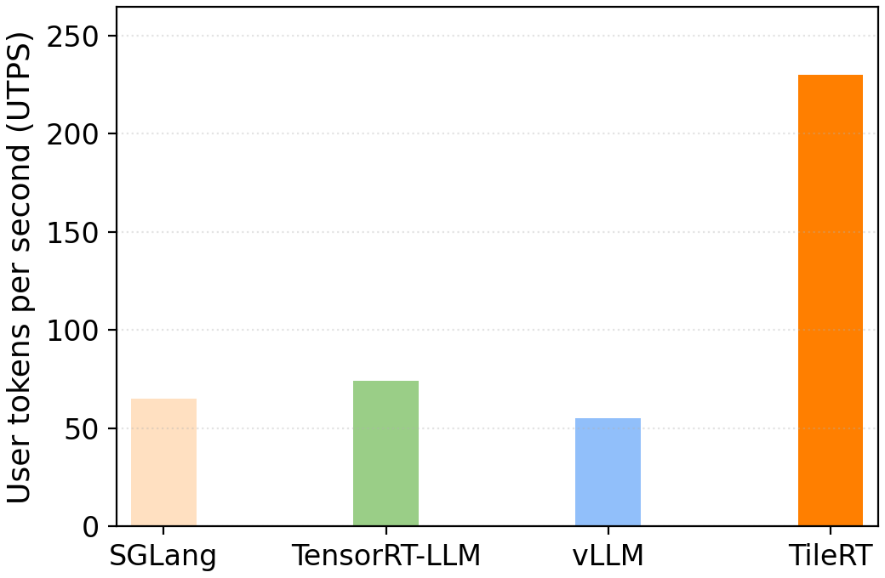

# TileRT 调研报告：面向超低延迟的 Tile 级推理引擎

## TileRT 概述

TileRT（Tile-Based Runtime）是 [tile-ai](https://github.com/tile-ai) 团队推出的一款专为超低延迟 LLM 推理设计的实验性 runtime。

### 性能表现

在典型的 BatchSize=1 场景下，TileRT 展现了显著的延迟优势：

<figure style="text-align:center;">
  
  <figcaption>测试配置：BatchSize=1, Prompt/Decode=1K/1K, 硬件环境：8×NVIDIA B200</figcaption>
</figure>

---

## 核心应用场景

TileRT 适合需要**低延迟、高 TPOT，但并发量不高**的场景，如：

- **高频交易**：毫秒级响应决定交易成败
- **交互式 AI 助手**：提升用户交互体验
- **实时决策系统**：如自动驾驶、具身智能，低延迟保障系统可靠性
- **长时运行 Agent**：需要快速响应的 AI Agent 场景
- **AI 编程助手**：开发者更关心单次请求的响应速度而非吞吐量
---

## 核心设计理念

首先明确：
1. TileLang 是 DSL（Domain Specific Language），而 TileRT 是 runtime。简单来说，DSL 承担"代码表达"，runtime 承担"代码执行"。TileRT 的编译器技术未来将整合到 [TileLang](https://github.com/tile-ai/tilelang) 项目中。
2. TileRT 主要解决的是多设备并行推理中计算通信互相等待的问题，对单卡推理优势不大

TileRT 采用编译器驱动的方法：前端（TileLang）编译器将 LLM 算子分解为可独立调度的 tile 级任务，随后 runtime 接管执行，以高度重叠的方式在**多个**设备间动态重新调度计算、I/O 和通信，从而减少等待时间，提高硬件利用率。

### 1. Tile 级细粒度并行（Tile-level Execution）

TileRT 最核心的设计理念是细粒度 tile 级任务执行。与传统执行方式的对比如下：

| 维度       | 传统层级执行                   | TileRT Tile 级执行                       |
| ---------- | ------------------------------ | ---------------------------------------- |
| 执行粒度   | 层级算子执行（整层完成后推进） | 细粒度 tile 级任务（拆分至算子子步骤）   |
| 执行流程   | 串行：计算 → I/O → 通信        | 重叠：计算 ∥ I/O ∥ 通信（并发执行）      |
| 同步机制   | 设备同步屏障（层间强制等待）   | 异步 tile 调度（满足依赖即执行）         |
| 硬件利用率 | 操作间大量空闲                 | 最大化利用（减少空闲时间）               |
| 任务覆盖   | 仅按层拆分                     | 覆盖 MLA/FFN/MoE 等子任务                |
| 队列管理   | 无专门任务队列                 | 三类队列调度（计算/I/O/通信）            |

### 2. 三级异步调度队列

TileRT 内部维护了三类独立的硬件队列：
*   **计算队列（Compute Queue）**：负责 Tile 级的矩阵运算。
*   **I/O 队列（I/O Queue）**：负责权重布局转换与内存搬运。
*   **通信队列（Comm Queue）**：负责多卡间的分布式 Partial Sum 传输。

这种设计允许在计算当前 Tile 的同时，通信引擎正在传输上一个 Tile 的结果，从而实现了**计算与通信的完全掩盖（Communication Hiding）**。

### 3. 面向 DeepSeek-V3 的原生优化

TileRT 对 DeepSeek-V3 引入的先进架构进行了专项加速：
*   **MLA (Multi-head Latent Attention)**：针对 MLA 的低秩投影特性，重新设计了 Tile 化读取模式，显著降低了 KV 缓存的访存开销。
*   **Sparse MoE**：优化了 MoE 专家路由后的 Tile 分发逻辑，确保在专家负载不均时仍能保持高效的任务流水。
*   **FP8 适配**：深度集成 FP8 量化算子，在 B200 硬件上充分释放张量核心（Tensor Core）的算力。

### 4. 易于验证的双模式设计

TileRT 支持双执行模式以确保优化过程中的正确性：
*   **Golden 模式**：基于标准 PyTorch 算子的参考实现，用于正确性验证。
*   **TileRT 模式**：基于 `torch.ops.tilert.*` 的高度优化实现，调用底层 Tile 级执行引擎。

---

## 部署限制与挑战

虽然 TileRT 在延迟上具有代差优势，但其目前仍处于实验阶段，存在以下局限：

1.  **权重预处理开销**：为了实现高效的 Tile 化访问，模型权重必须进行**物理布局转换（Layout Transformation）**。这意味着无法直接加载 standard checkpoints，需要使用项目提供的转换工具。
2.  **硬件生态狭窄**：当前高度依赖 NVIDIA Blackwell (B200) 的硬件特性，对旧代 GPU 或非 NVIDIA 硬件支持有限。
3.  **开发门槛高**：扩展新算子需要深入理解 TileLang DSL 以及 Tile 级的依赖管理，对普通开发者不友好。
4.  **模型通用性**：目前主要针对 DeepSeek-V3/V3.2 系列模型进行深度硬编码优化，尚未实现通用模型的一键适配。
6. **项目状态**：仍为实验性预览版，稳定性和功能覆盖度有待提升

---

## 相关生态项目

| 项目 | 角色定位 | 相互关系 |
| :--- | :--- | :--- |
| **[TileLang](https://github.com/tile-ai/tilelang)** | 编译器 DSL | 为 TileRT 提供算子级的 Tile 表达能力 |
| **[TileScale](https://github.com/tile-ai/tilescale)** | 分布式框架 | 负责多机多卡环境下的策略切分与调度 |
| **[TileLang-Ascend](https://github.com/tile-ai/tilelang-ascend)** | 国产化适配 | 针对华为昇腾 NPU 优化的 TileLang 变体 |
| **TileRT** | 执行引擎 (Runtime) | 负责将编译器生成的 Tile 任务高效落地到硬件执行 |

---

## 参考资料

*   **GitHub**: [tile-ai/TileRT](https://github.com/tile-ai/TileRT)
*   **Documentation**: [TileLang Docs](https://tilelang.tile-ai.cn/)
*   **Models**: [DeepSeek-V3.2-Exp Optimized Weights](https://huggingface.co/collections/Tile-AI/tilert)