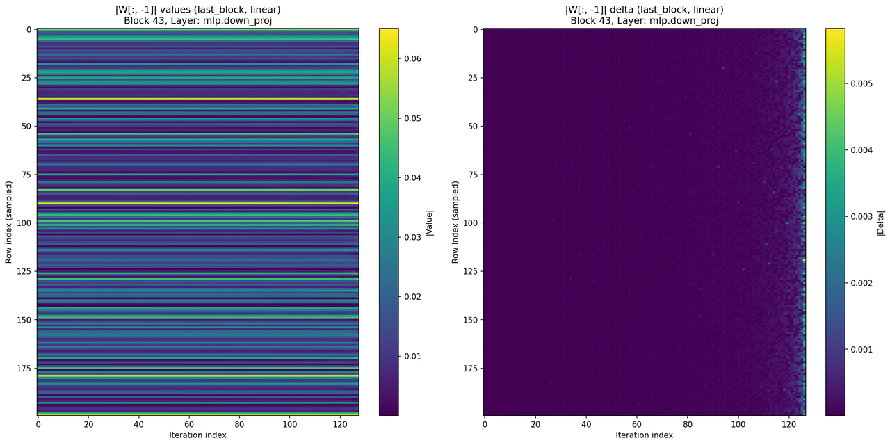
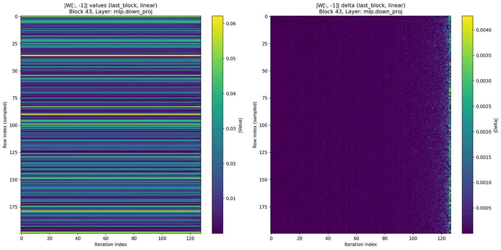
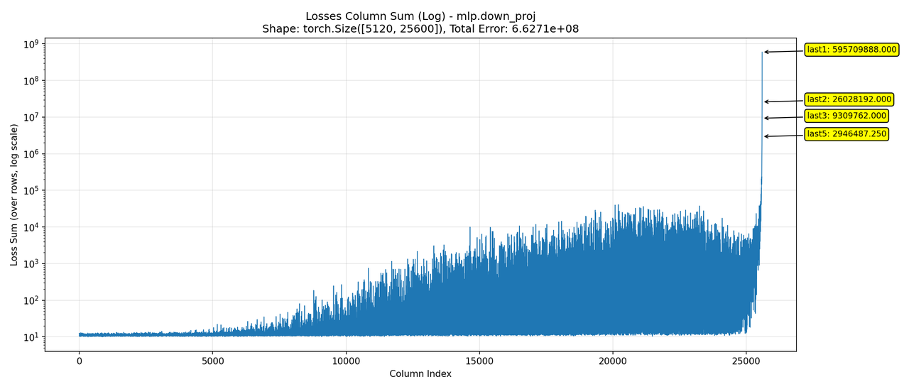
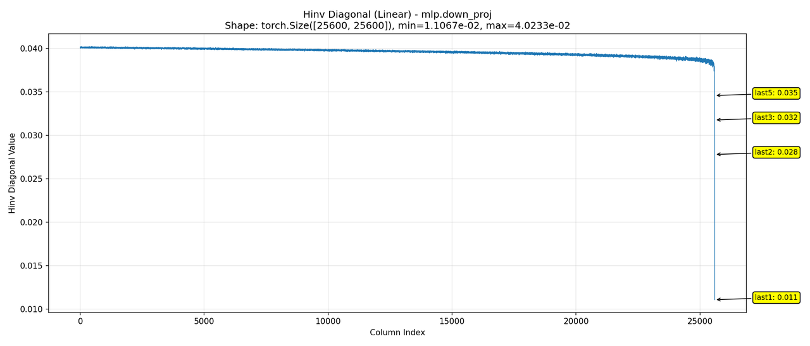

# GPTQv2 数值稳定性分析：Loss Spike 现象研究

## 1. 背景与现象

在对 Qwen3-32B 模型进行 [GPTQv2](https://arxiv.org/abs/2504.02692) 量化时，观察到了 **Loss Spike**（损失突增）现象，导致最终量化模型的效果显著下降。
在[之前的实验](https://mx4lbik1jc.feishu.cn/wiki/JQ5BwwI7Uiw6jOkQnQkcZOefnEg)中发现，该问题具有一定的随机性，施加微小的扰动即可避免。本文旨在进一步深入分析 Loss Spike 产生的根本原因。

## 2. Loss Spike 的直接成因：数值异常

GPTQ 的 Loss 计算公式如下：

$$
\text{Loss} = \frac{(w - q)^2}{2 d^2}
$$

其中：
- $w, q$：分别为量化前后的权重；
- $d$：Hessian 矩阵逆的 Cholesky 分解对角线元素。

实测发现，在 Loss Spike 发生时，分子和分母均出现了极端的数值异常：
- **分子爆炸**：$(w-q)^2$ 极大。例如 $(30 - \text{quantized\_val})^2$。
- **分母消失**：$d^2$ 极小。例如 $0.01^2$。

计算示例：$30^2 / (2 \times 0.01^2) \approx 4,500,000$。

### 2.1 为什么 $(w - q)$ 如此巨大？
随着量化补偿过程的进行（column-wise update），后排权重的累积偏移量越来越大。原数值绝对值小于 1 的权重，在经过补偿后，在最后一列的数值甚至可超过 30（如下图所示）。

由于量化范围通常是基于原始权重设定的（或静态量化），巨大的权重偏移导致严重的截断误差，使得 $w$ 与 $q$ 差异巨大。

图 1：权重最后一列（y）随 GPTQ 迭代（x）的变化情况。左：绝对数值；右：变化幅度

### 2.2 为什么 $d$ 如此微小？
在 GPTQ 算法中，由于 Hessian 矩阵的特殊结构，经过 Cholesky 分解求逆后的对角线元素 $d$ 呈现随迭代逐渐减小的趋势。如下图所示：

图 2：Hessian 矩阵逆对角线元素的变化趋势

# 2. 病态矩阵导致了 loss spike?

下图中，指针指向了出现 loss spike 的的 43 层，可以看到在该层，多个指标都出现了异常：

- dxxt：量化的输入和未量化输入的协方差矩阵，其f-norm异常高  
- H: hessian 矩阵, 其 f-norm 和条件数都异常高  
- P: gptq 基础上，gptqv2 新增补偿的部分，其 f-norm 也异常高

**但：**
1. 其中仅有 P 矩阵的 f-norm 在 43 层出现最高值，其余指标在其他层也出现了同样大的值。因此，病态矩阵与 loss spike 有关联，但可能不是主要原因  
2. P矩阵的f-norm在43层出现的最高值似乎也没有那么高，可能只是其他层的2倍。

# 3. 权重角度

第一节的分析中，发现权重的问题远比hessian更严重，因此本节中着重分析模型权重的变化情况。

回到下面这张图，可以看到，权重最后一列的数值在最后几次迭代时急剧增加，下面将尝试分析该原因。

权重最后一列（y）随gptq迭代的变化情况。左：绝对数值；右：变化大小

gptqv2 的权重补偿过程可以用如下公式描述：

$$
W _ {:, j} \leftarrow W _ {:, j} + \underbrace {E r r _ {: , i} \times H _ {i , j} ^ {- 1}} _ {\text {T e r m 1 : 误 差 修 正 项}} + \underbrace {W _ {: , i} \times P _ {i , j}} _ {\text {T e r m 2 : 输 入 漂 移 补 偿 项}} \quad \text {f o r} \quad i <   j
$$

其中 Err 为量化误差，term1 为 gptq 原本算法，term2 为 gptqv2 新增

### 如果仅保留第一项

如果仅保留 term1（即 gptq 原版算法），权重不会变得很大，但在最后几个 iter，依然会出现相对大幅的变化。事实上，如果换成 log-scale（如下图右侧），则看的更加明显：权重一直有在变大，且变大的速度为约为指数级别

### 如果仅保留第二项

有趣的是，如果仅保留 term2，权重变大的趋势则并不明显，仅在最后几个 step 出现大幅增长

### 如果降低第二项的权重到原来的  $40\%$

实际实现中，term2 的权重一般为 0.25。如果将其设为 0.1，则模型权重最终的数值不会出现大幅变化的情况。此时模型权重的变化情况更类似【仅保留第一项】

### 如果降低第二项的权重到原来的  $200\%$

将 term2 的权重改为 0.5。问题则更加严重

综上，说明权重的异常变化不仅仅是gptqv2新增的term2带来的，而是term1和term2共同作用的结果：gptq（term1）原本就有对权重扰动越来越大的趋势，而gptqv2（term2）则大大加速了这一过程。

# 4. loss 角度

### 如果仅保留第一项

### 如果仅保留第二项

### 两项都有

gptqv2 的权重补偿过程可以用如下公式描述：

$$
W _ {:, j} \leftarrow W _ {:, j} + \underbrace {E r r _ {: , i} \times H _ {i , j} ^ {- 1}} _ {\text {T e r m 1 : 误 差 修 正 项}} + \underbrace {W _ {: , i} \times P _ {i , j}} _ {\text {T e r m 2 : 输 入 漂 移 补 偿 项}} \quad \text {f o r} \quad i <   j
$$

其中 Err 为量化误差，term1 为 gptq 原本算法，term2 为 gptqv2 新增

从 loss 角度可以看得更清楚，term1 导致了最终 loss 的超指数级攀升，term2 导致了 loss 在中段的指数级攀升

# 6. 理论分析

$$
W _ {:, j} \leftarrow W _ {:, j} + \underbrace {E r r _ {: , i} \times H _ {i , j} ^ {- 1}} _ {\text {T e r m 1 : 误 差 修 正 项}} + \underbrace {W _ {: , i} \times P _ {i , j}} _ {\text {T e r m 2 : 输 入 漂 移 补 偿 项}} \quad \text {f o r} \quad i <   j
$$

# 6.1 第一项

$$
W _ {j} \leftarrow W _ {j} + \sum_ {i <   j} E r r _ {i} \times H _ {i, j} ^ {- 1}
$$

观察该公式， $W_{j}$  的变化来自  $Err$  和  $H^{-1}$ 。

对于  $H^{-1}$ , 可以发现其曲线呈递减趋势, 且到了后面会加速下降。这为  $W_{j}$  的变化提供了一部分动力。

对于  $Err$ ，其为量化误差。由于量化的 scale 和 zeros 提前算好（等效为静态量化），因此当补偿后的权重没有超过原本的表达范围（例如 int8 为 256），其量化误差有界，上界为  $\frac{\max(W)}{256}$  （以 int8 为例）

而当补偿后的权重变化过大，则  $Err$  不再有姐，且随权重绝对值的增长而线性增长。

因此，Err和  $H^{-1}$  共同促进了量化损失的超线性增长，如下图所示。

# 6.2 第二项

$$
W _ {j} \leftarrow W _ {j} + \sum_ {i <   j} W _ {i} \times P _ {i, j}
$$

若  $P_{i,j} = 1$  ，则这是一个前缀和公式，其渐进增长速度是指数级。

若  $P_{i,j}$  是随机数，有正有负，其正反馈依然存在。出现类似随机游走导致的方差爆炸，如下图所示

# 附录
李琪的分析：https://mx4lbik1jc.feishu.cn/wiki/XBWKwnmZ2i80DDkrKHGckKxrnDb
