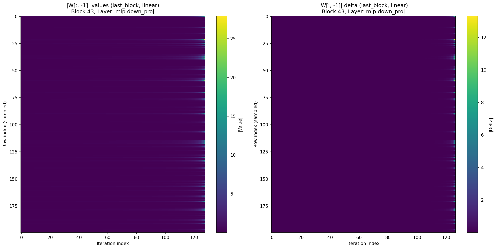
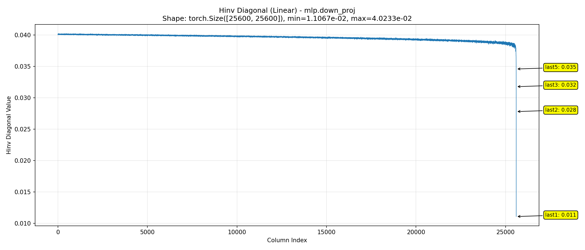
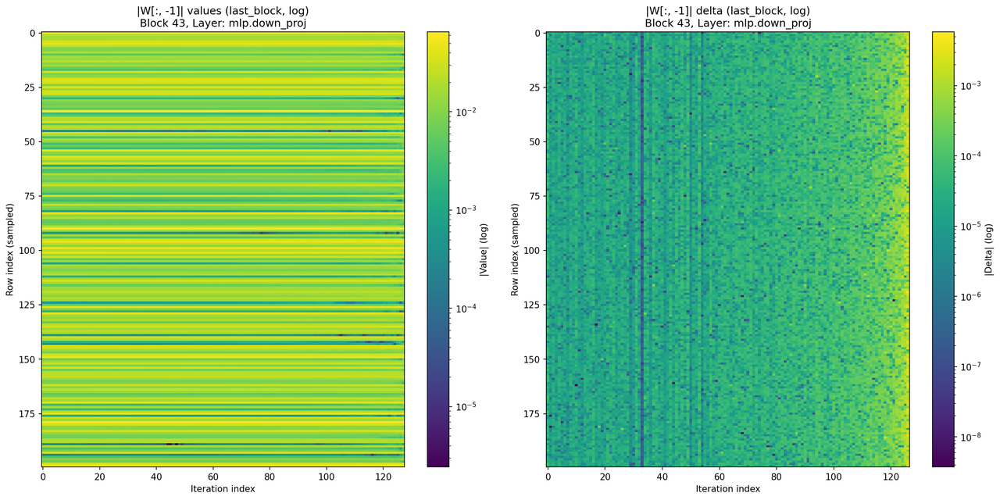
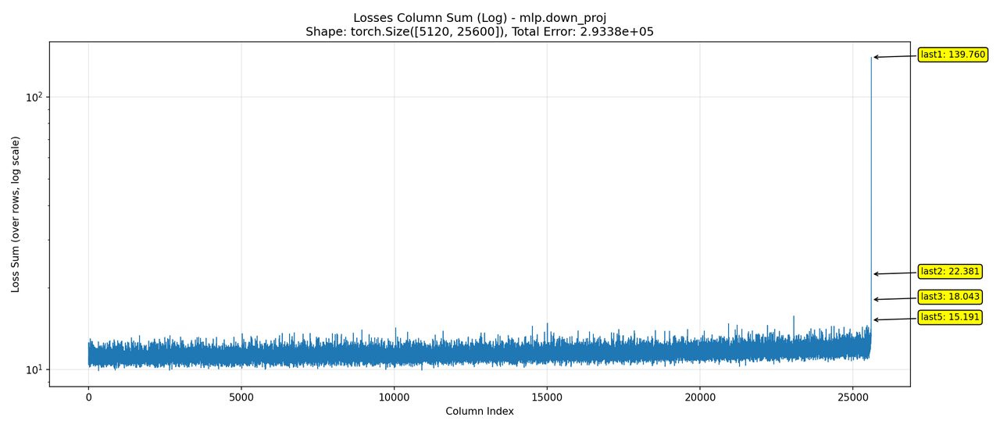
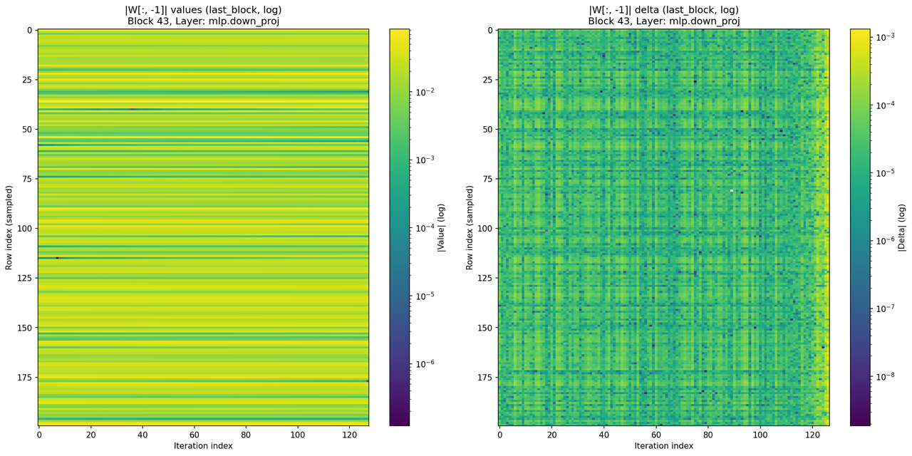
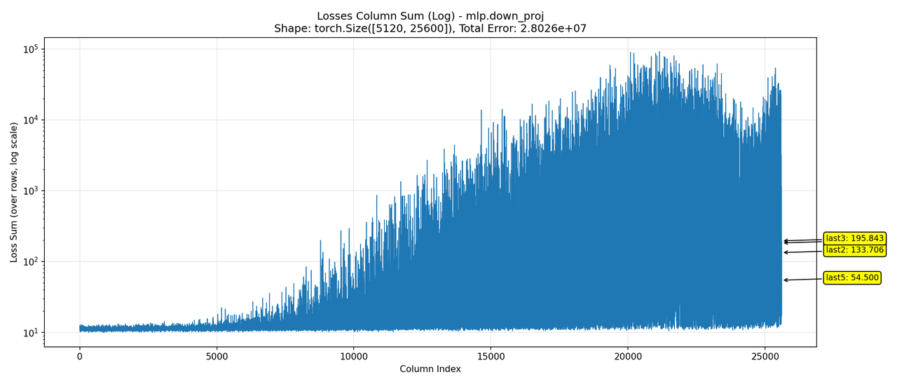
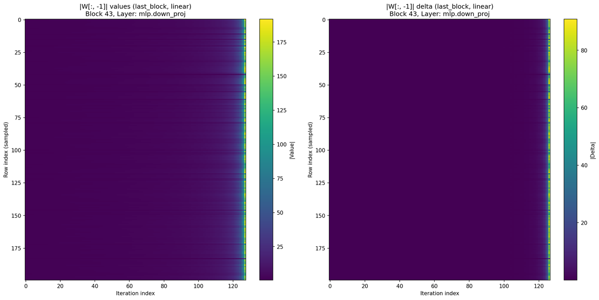
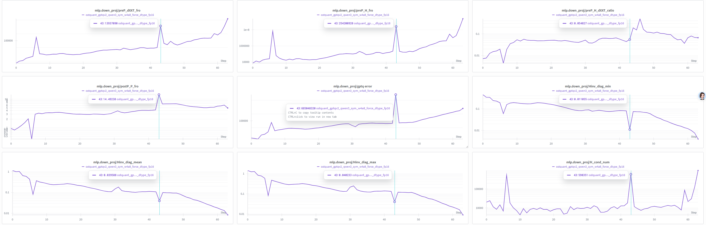

# GPTQv2 数值稳定性分析：Loss Spike 现象研究

## TL;DR

**背景**：
在对 Qwen3-32B 模型进行 [GPTQv2](https://arxiv.org/abs/2504.02692) 量化时，观察到了 Loss Spike现象，且最终量化模型的效果显著下降。

在[之前的实验](https://mx4lbik1jc.feishu.cn/wiki/JQ5BwwI7Uiw6jOkQnQkcZOefnEg)中发现，该问题具有一定的随机性，施加微小的扰动即可避免。本文旨在进一步深入分析 Loss Spike 产生的根本原因。

**本文结论**：
1. **直接原因**：量化补偿过程导致最后一列权重数值爆炸（>30），远超量化范围，同时配合 Hessian 逆对角元素极小，引爆 Loss。
2. **根本机制**：GPTQ 的误差修正与 GPTQv2 的输入补偿形成恶性协同。Term 2 引入的类似前缀和的累积效应，在长序列更新中将微小的扰动进行了指数级放大。
3. **解决方向**：适当降低 Term 2（输入补偿）的权重系数 $\alpha$ 可以抑制这种指数级增长。

## 2. Loss Spike 的直接成因：数值异常

GPTQ 的 Loss 计算公式如下：

$$
\text{Loss} = \frac{(w - q)^2}{2 d^2}
$$

其中：
- $w, q$：分别为量化前后的权重；
- $d$：Hessian 矩阵逆的 Cholesky 分解对角线元素。

实测发现，在 Loss Spike 发生时，分子和分母均出现了极端的数值异常：
- **分子爆炸**：$(w-q)^2$ 极大。例如 30。
- **分母消失**：$d^2$ 极小。例如 $0.01^2$。

计算示例：$30^2 / (2 \times 0.01^2) \approx 4,500,000$。

### 2.1 为什么 $(w - q)$ 如此巨大？
随着量化补偿过程的进行（column-wise update），后排权重的累积偏移量越来越大。原数值绝对值小于 1 的权重，在经过补偿后，在最后一列的数值甚至可超过 30（如下图所示）。

由于量化范围通常是基于原始权重设定的（或静态量化），巨大的权重偏移导致严重的截断误差，使得 $w$ 与 $q$ 差异巨大。

图 1：权重最后一列（y）随 GPTQ 迭代（x）的变化情况。左：绝对数值；右：变化幅度

### 2.2 为什么 $d$ 如此微小？
在 GPTQ 算法中，由于 Hessian 矩阵的特殊结构，经过 Cholesky 分解求逆后的对角线元素 $d$ 呈现随迭代逐渐减小的趋势。如下图所示：

图 2：Hessian 矩阵逆对角线元素的变化趋势

---

## 3. 核心机制分析：权重更新的动态不稳定性

为了探究权重异常增长的根源，我们需要分析 GPTQv2 的权重更新机制。

### 3.1 更新公式分解
GPTQv2 的权重补偿过程可描述为：

$$
W_{:, j} \leftarrow W_{:, j} + \underbrace{Err_{:, i} \times H_{i, j}^{-1}}_{\text{Term 1: 误差修正项 (GPTQ)}} + \underbrace{W_{:, i} \times P_{i, j}}_{\text{Term 2: 输入漂移补偿项 (GPTQv2)}} \quad (\text{for } i < j)
$$

- **Term 1 (GPTQ 原生项)**：利用 Hessian 逆矩阵将量化误差 $Err$ 传导至后续列。
- **Term 2 (GPTQv2 新增项)**：利用 $P$ 矩阵补偿因量化导致的输入activation差异

我们分别分析这两项在权重数值爆炸中的作用。

### 3.2 Term 1：GPTQ 原生不稳定性
**现象**：如下图所示，注意 colorbar 是对数坐标。如果仅保留 Term 1（退化为标准 GPTQ），权重虽然不会增长到极端数值（左），但在整个阶段仍表现出指数级的增长趋势（右）。

图 3：仅保留 Term 1 时的权重变化（Log Scale）

**理论分析**：

Term1的作用可以简化为如下公式：
$$
W_{j} \leftarrow W_{j} + \sum_{i < j} Err_{i} \times H_{i, j}^{-1}
$$

其中，对 $W_{j}$ 变化的贡献来自两部分：
1.  **$H^{-1}$ 的加速衰减**：$H^{-1}$ 的非对角元素在序列后段呈现加速变化的趋势（见图 2），放大了量化误差的影响。
2.  **误差放大的正反馈**：$Err$ 是权重的量化误差。
    *   当权重在量化范围内（如 int8 的 [-127, 127] 映射范围）时，$Err$ 有界。上界为 $\frac{\max(W)}{256}$（以 int8 为例）。
    *   一旦权重经过多次补偿后超出量化范围，$Err$ 将随权重绝对值的增加而线性增长。
    *   **恶性循环**：权重变大 $\rightarrow$ $Err$ 变大 $\rightarrow$ 补偿给后续列的值变大 $\rightarrow$ 后续列权重更大。

从 Loss 角度看，Term 1 导致了 Loss 在末期的**超指数级（Super-exponential）攀升**。

图 4：仅保留 Term 1 时的 Loss 变化

### 3.3 Term 2：GPTQv2 的加速作用
**现象**：如果仅保留 Term 2，权重在大部分时间内保持稳定，但同样存在指数上涨的趋势，如下图。

图 5：仅保留 Term 2 时的权重变化（Log Scale）

**理论分析**：
$$
W_{j} \leftarrow W_{j} + \sum_{i < j} W_{i} \times P_{i, j}
$$

其中：
*   若 $P_{i,j} \approx 1$，则是一个**前缀和**式的更新过程，则 $W_j$ 呈指数级增长。
*   若 $P_{i,j}$ 为随机分布，则表现为随机游走（Random Walk），其方差随步数 $j$ 呈指数级上升。

从 Loss 角度看，Term 2 导致了 Loss 在中段就开始出现指数级上升。如下图所示，随着迭代进行，loss的方差成指数上升趋势。

图 5：仅保留 Term 2 时的权重变化（Log Scale）

### 3.4 共同作用 (Synergy)
实际场景中（Term 1 + Term 2，通常 Term 2 权重系数 $\alpha=0.25$），两者叠加产生了剧烈的化学反应：
1.  **Term 1** 提供了基础的不稳定性趋势。
2.  **Term 2** 大大加速了误差积累的过程。

实验表明，调节 Term 2 的系数 $\alpha$ 对结果影响巨大：
*   $\alpha = 0.1$：权重增长平缓，接近仅有 Term 1 的情况。
*   $\alpha = 0.5$：权重爆炸提前且剧烈，Loss Spike 必现。

图 6：Term 2 系数放大至 0.5 时的权重爆炸

**结论**：权重的异常变化是 Term 1 和 Term 2 共同作用的结果。GPTQ 本身隐含了对权重扰动放大的趋势，而 GPTQv2 的输入补偿机制在特定矩阵性质下加速了这一过程，导致数值溢出。

---

## 4. 辅助因素：病态矩阵 (Ill-conditioned Matrix)

我们还考察了矩阵的数值性质。在出现 Loss Spike 的第 43 层，多个矩阵指标出现异常：

图 7：各矩阵指标在不同层级的分布

*   **$DXX^T$ (输入协方差)**：F-norm 异常高。
*   **$H$ (Hessian)**：F-norm 和条件数（Condition Number）异常高。
*   **$P$ (补偿矩阵)**：F-norm 在 43 层达到峰值。

**分析**：
虽然矩阵病态是 Loss Spike 的重要背景，但可能并非唯一决定性因素：
1.  除 $P$ 矩阵外，其他指标在未出现 Spike 的层级也存在高值。
2.  $P$ 矩阵在 43 层的峰值虽高，但并未与其他层形成数量级差异（约 2 倍）。

这表明**病态矩阵是“火药”，而权重更新的动态不稳定性是“火星”**。

---
## 5. 解决方案
从影响loss幅度的部分出发：
1. Hessian对角线元素出现小值：提高damp系数。更高的damp系数可以稳定量化过程，但可能造成Hessian矩阵的失真。因此需要权衡，建议优先尝试0.05，在发现出现loss spike后，按0.01增加。
2. Term2的权重系数过大：降低Term2的权重系数。这同样需要权衡。
3. 初始化计算权重的scale和zero时，不要用MSE初始化，避免缩小权重的动态范围。

## 附录
*   李琪的详细分析报告：[Feishu Link](https://mx4lbik1jc.feishu.cn/wiki/XBWKwnmZ2i80DDkrKHGckKxrnDb)
