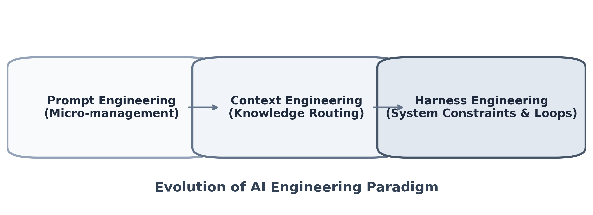

<!--
如果图片路径不存在，那表示是这是一个placeholder，需要你生成图片放到对应的位置上

-->

# Harness Engineering 调研报告

## 背景与演化

Harness Engineering 的概念最早由 Mitchell Hashimoto 等社区开发者提出，OpenAI 在 26 年初的百万级代码项目中将其系统化并大规模验证
OpenAI 在其 [实践文章](https://openai.com/index/harness-engineering/) 中展示了完全依赖 Agent (Codex) 零手写代码完成百万行系统重构的极端案例：

| 指标         | 核心数据                    |
| ------------ | --------------------------- |
| 周期与人力   | 5 个月，3-7 人团队          |
| 代码与产出   | ~100 万行代码，~1500 PR     |
| 吞吐量与收益 | 3.5 PR/人/天，效率提升 ~10x |

这种开发模式将工程重心从“直接编写业务逻辑”转移到“构建基础设施”：
- 设计高容错的运行环境
- 构建闭环反馈回路
- 建立确定性的架构约束

范式的演进本质上反映了模型能力的溢出，人类微操干预的必要性降低：
- Prompt Engineering：微操输入，要求模型一次性输出正确结果
- Context Engineering：知识路由，提供外部挂载点以丰富模型视野
- Harness Engineering：系统级约束与自动化执行，关注环境流转，最终达到 Humans steer, agents execute

<figure style="text-align:center;">
  
  <figcaption>工程范式演进：微操代价上升，系统约束接管</figcaption>
</figure>

## 核心定义

Harness Engineering 是一种纯 Agent 驱动的软件工程范式
核心是将 Agent 视作计算核心 (Model ≈ CPU)，而 Harness 则是提供上下文调度、异常捕获和状态流转的操作系统 (Harness ≈ OS/Runtime), Agent = Model+ Harness
工程师的工作流随之改变，角色彻底转变为环境架构师和策略制定者

## 落地支柱

### Context Engineering (上下文工程)
拒绝向 Agent 倾倒全局代码，采用“渐进式披露”策略
根目录的 `AGENTS.md` 等文档仅作为轻量级索引路由，具体模块规则分散在 `docs/` 目录，按需加载，避免 Context 污染和冗余 Token 消耗

### Architectural Constraints (架构约束)
用强类型、依赖注入和物理隔离替代 Prompt 中的软约束
例如强制执行 Types → Config → Repo → Service → Runtime → UI 的单向依赖，在 CI 阶段直接阻断 Agent 的越权调用，而非寄希望于模型遵守文档口头约束

### Feedback Loops (反馈循环)
将 Code Review、单元测试和 Lint 检查自动化并接入 Agent 的自迭代循环
借鉴类似 Claude Code 的 Hook 机制，使 Agent 每次改动都能立即获得确定性的失败信号并自行触发修正

### Entropy Management (熵管理)
高频度的 Agent 提交极易积累“AI 残渣”和冗余抽象
需要引入定期的自动重构流水线 (Garbage Collection)，将共性的最佳实践固化为 Lint 规则或底层基类，防止技术债雪崩

## 实践经验与反思

### 文件架构图
```
AGENTS.md                               # Agent 行为约束与协作入口（宜精简，链到 docs）
ARCHITECTURE.md                         # 系统分层与模块边界总览
docs/                                   # 渐进式披露：详细文档根目录
├── design-docs/                        # 设计决策与方案沉淀
│   ├── index.md
│   ├── core-beliefs.md
│   └── ...
├── exec-plans/                         # 可执行计划（任务拆解与跟踪）
│   ├── active/
│   ├── completed/
│   └── tech-debt-tracker.md
├── generated/                          # 由工具/流水线自动生成的文档
│   └── db-schema.md
├── product-specs/                      # 产品功能与体验规格
│   ├── index.md
│   ├── new-user-onboarding.md
│   └── ...
├── references/                         # 外部资料压缩版，供 Agent 快速检索
│   ├── design-system-reference-llms.txt
│   ├── nixpacks-llms.txt
│   ├── uv-llms.txt
│   └── ...
├── DESIGN.md                           # 交互与视觉设计约束
├── FRONTEND.md                         # 前端工程约定（框架、目录、状态）
├── PLANS.md                            # 路线图与里程碑（中长期）
├── PRODUCT_SENSE.md                    # 产品判断与取舍原则
├── QUALITY_SCORE.md                    # 质量门禁与评分口径
├── RELIABILITY.md                      # SLO、容错、降级与可观测性
└── SECURITY.md                         # 威胁模型、密钥与合规要求
```

### 效率悖论与冷启动阵痛
在 Harness 环境建立初期，整体效率往往低于人工开发
因缺乏配套的自动化验证、明确的 Lint 规则和清晰的领域边界，Agent 会频繁陷入修复循环或产出幻觉代码，基础设施的完备度直接决定了 Agent 的产出上限

### 高吞吐范式下的取舍：先合并后修复
在极高并发的产出下，传统工程严格的 Gatekeeper 模式会成为瓶颈
- 传统模式：防错优先，单次修改成本高，准入卡点严格
- 高吞吐模式：容错优先，依赖快速 Merge + 快速发现回滚，纠错成本远低于等待阻塞的成本

这种模式下必须容忍局部的代码丑陋，防止过早抽象 (Three similar lines of code is better than a premature abstraction)

### 经验固化闭环
Agent 每解决一个复杂 Bug，其推理过程和修复策略必须被要求沉淀至知识库或转换为持续集成测试
未被泛化吸收的 Case 只是单点修复，无法提升系统的整体鲁棒性

## 总结

在大规模的纯 Agent 开发中，代码的一致性不再由开发者手动 review 保证，而是完全依赖底层基础设施的纪律性
当前算法工程的挑战已经从“如何让模型写对一段逻辑”，转向了“如何设计一套容错约束系统，让模型在不断犯错和自动纠错中必然收敛到可用状态”