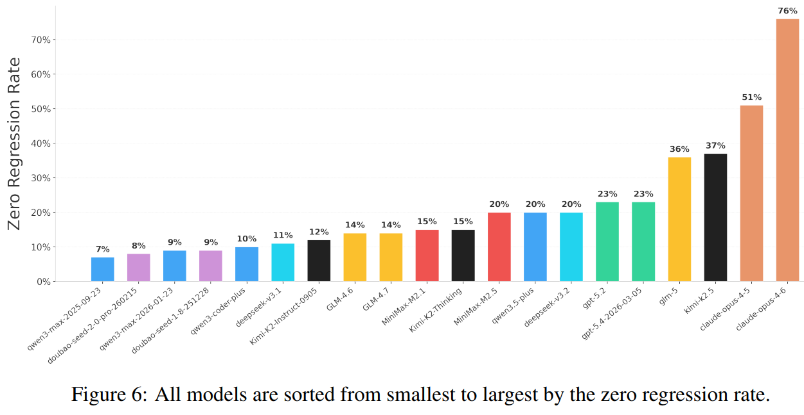

<!--
1. 如果图片路径不存在，那表示是这是一个placeholder，如果你是Gemini，需要你生成图片放到对应的位置上
2. harness engineering是什么，怎么演进的，作用是什么，如何使用，未来如何发展
3. 不能做成枯燥的列表/流水账，要娓娓道来，但不能变成纯讲故事，略微有故事性即可

-->

# Harness Engineering 调研报告
Prompt、Context、Harness engineering解决的是不同层级的问题：

| 范式                | 解决的问题                              | 核心对象 | 典型手段                              |
| ------------------- | --------------------------------------- | -------- | ------------------------------------- |
| Prompt Engineering  | 这次怎么让模型答对（单次输出质量）      | 单轮输入 | 模板、few-shot、格式约束              |
| Context Engineering | 决策所需信息有没有被正确装进上下文      | 信息装载 | 检索、RAG、MCP、知识压缩              |
| Harness Engineering | 怎么让 agent 在真实工程里长时间持续做对 | 执行系统 | hooks、lint、progress file、evaluator |

在工程实践中，当 agent 读仓库、跑命令、改代码、提 PR 并做回归验证时，瓶颈往往会从单轮表达，挪到“该看的有没有被看见”，再到约束是否足够、反馈环是否闭合、失败后能不能低成本恢复。

## 谁提出了Harness Engineering

Harness Engineering 最早由 Mitchell Hashimoto 在博客 [My AI Adoption Journey](https://mitchellh.com/writing/my-ai-adoption-journey) 中提出，一开始的定义很朴素：当 agent 重复犯某种错时，把这类错误固化成系统性的预防措施，而不是指望靠改 prompt 来兜底——也就是把问题从「对话里临时修」推进成「仓库里可复用的机制」。

[OpenAI](https://openai.com/index/harness-engineering/) 则把这件事推进成了工程范式，在一个 agent-first 的产品开发流程里，人的主要工作不再是亲手写每一段代码，而是让 agent 有能力把代码写出来。这个项目的一些指标：

| 指标              | 数值                     |
| ----------------- | ------------------------ |
| 时间周期          | 约 5 个月                |
| 团队规模          | 最初 3 人，后扩展到 7 人 |
| 代码总量          | 约 100 万行              |
| 人工手写代码      | 0 行                     |
| Pull Request 总数 | 约 1,500 个              |
| 人均日吞吐量      | 约 3.5 个 PR/人/天       |

这种开发模式将工程重心从"直接编写业务逻辑"转移到"构建基础设施"：
- 设计高容错的运行环境
- 构建闭环反馈回路
- 建立确定性的架构约束

## Harness 本质是个闭环控制系统

一个常见比喻是 Model 像 CPU，Harness 像 OS 或 Runtime，而 Agent = Model + Harness。

从 [ThoughtWorks 对 Harness 的梳理](https://martinfowler.com/articles/harness-engineering.html) 来看，Harness 本质上是一个控制回路，核心是两类控制手段

| 方向                | 作用                                | 典型实现                                    |
| ------------------- | ----------------------------------- | ------------------------------------------- |
| Guides（前馈控制）  | 在 agent 动手前收窄搜索空间         | AGENTS.md、ARCHITECTURE.md、schema、skills  |
| Sensors（反馈控制） | 在 agent 动手后发现偏差并推动自修复 | lint、编译检查、安全/策略扫描、review agent |

它不是替模型思考，而是通过前馈和反馈，把一个**高方差**系统压到可控区间里

## 为什么需要harness

SWE-CI 是一个让代码 agent 在真实仓库的多轮 CI 演化过程中不断改代码、跑测试，从而评估其“长期代码维护能力（而非一次性正确性）”的 benchmark。
在其测试结果中，仅有Claude Opus 4.5/4.6的zero regression rate超过50%，其他模型的长期代码维护能力远低于人工，很容易将代码变成“屎山”
<figure style="text-align:center;">
  
  <figcaption>SWE-CI zero regression rate</figcaption>
</figure>

## OpenAI 五条原则

| 理念                                   | 真实含义                                 | 对应的工程动作                                          |
| -------------------------------------- | ---------------------------------------- | ------------------------------------------------------- |
| What the agent can't see doesn't exist | 不在 repo 内、不可版本化的知识等于不存在 | Slack 讨论、设计决策、schema 必须沉淀为 markdown 或代码 |
| Ask what capability is missing         | 错误优先归因为环境缺陷，而非模型能力     | 补齐 script、LSP 或结构化 artifact，别手动帮它兜底      |
| Mechanical enforcement                 | 文档防君子不防 agent                     | 用 lint、CI 规则、结构约束把边界强行物理化              |
| Give the agent eyes                    | 代码自身无法验证动态行为                 | 接入 Playwright 自动化、日志采集、trace 和 UI 截图      |
| A map, not a manual                    | 巨型说明书会挤掉真正相关的 context       | 薄 `AGENTS.md` 做索引，细节按需加载下沉到分层 docs      |

## 常见发散与失败模式

| 症状                     | 根因                                               | 补救动作                                               |
| ------------------------ | -------------------------------------------------- | ------------------------------------------------------ |
| 上下文越长 agent 越笨    | 无关搜索结果、长日志挤占了核心注意力               | 限制单次注入信息量，用过滤测试替代全量测试跑出的长报错 |
| `AGENTS.md` 越长效果越差 | 巨型说明书不可验证、信号权重失真                   | 把入口文件削薄成目录，具体细则下沉到特定模块按需加载   |
| 局部实现好但整体拼不起来 | 过于关注局部 completeness，丢失了 global coherence | 引入 milestone gate，强制先连线跑通主链路再打磨细节    |
| agent 总说自己已经搞定了 | 模型对自身输出的评估天然带有正向偏误               | 引入独立的 evaluator 探针，如强制 Playwright 截图校验  |
| 合并快但代码库越来越脏   | 吞吐量上去了，熵管理没有跟上                       | 单独开启 cleanup lane，用自动化工具定期扫除无效抽象    |

## 行业实践案例

### LangChain：纯 Harness 改进，13.7 个百分点提升

[LangChain](https://blog.langchain.com/improving-deep-agents-with-harness-engineering/) 在 Terminal Bench 2.0 上将得分从 52.8% 提升到 66.5%——从 Top 30 开外跃升至 Top 5——模型 (GPT-5.2-Codex) 零更换，仅改变 Harness。关键技术：

- **Reasoning Sandwich**：planning 阶段使用 xhigh reasoning，implementation 阶段降至 high，verification 阶段回升至 xhigh。纯 xhigh 反而只有 53.9%（因超时）
- **LoopDetectionMiddleware**：追踪每个文件的编辑次数，超过阈值后触发"consider reconsidering your approach"
- **PreCompletionChecklistMiddleware**：在 Agent 退出前拦截，强制其对照任务规格运行验证
- **Trace Analyzer Skill**：自动从 LangSmith trace 中衍生并行错误分析 Agent，类似 ensemble boosting

## 其他insights
- **Harness 是动态折旧的资产**，今天的 guardrail 往往是在为现有模型的缺陷打补丁，切忌把历史包袱当成永久的最佳实践，甚至后续可能出现新的xxx engineering

- **自然语言规则的边际收益递减**，写一大堆“你必须注意XXX”的 prompt 很快会失效，把规则改成强制lint规则等会更好

## 反直觉的结论
### 过度规格化悖论

[ETH Zurich 对 138 个 agentfile 的研究](https://arxiv.org/html/2603.25723v1)发现：
- LLM 生成的 agentfile 对性能有**负面**影响——生成内容倾向于泛泛而谈的最佳实践，缺乏针对具体代码库的关键约束，反而稀释了有效信号
- 人工编写的文件在设计不佳时也仅带来约 4% 的提升——设计不佳指缺乏可执行性的描述性文档，Agent 读了但无法据此做出更好的决策
- Agent 处理指令时多消耗 14-22% 的推理 token，但解决率没有提升——指令增加了 Agent 需要内化的信息量，但这些信息对实际任务分解和执行没有提供增量价值

### 效率悖论与冷启动阵痛
在 Harness 环境建立初期，整体效率往往低于人工开发
因缺乏配套的自动化验证、明确的 Lint 规则和清晰的领域边界，Agent 会频繁陷入修复循环或产出幻觉代码，基础设施的完备度直接决定了 Agent 的产出上限

OpenAI 报告的总效率提升约 [10x](https://openai.com/index/harness-engineering/)，但这是 Harness 成熟后的稳态数据。在冷启动阶段，基础设施的构建开销使实际产出低于纯人工开发。吞吐量随团队规模增长而非线性提升，因为更好的 Harness 设计对每一位工程师产生复合价值——这是传统开发中不存在的网络效应

### 高吞吐范式下的取舍：先合并后修复
在极高并发的产出下，传统工程严格的 Gatekeeper 模式会成为瓶颈
- 传统模式：防错优先，单次修改成本高，准入卡点严格
- 高吞吐模式：容错优先，依赖快速 Merge + 快速发现回滚，纠错成本远低于等待阻塞的成本

这种模式下必须容忍局部的代码丑陋，防止过早抽象 (Three similar lines of code is better than a premature abstraction)

### 避免过早抽象

> Three similar lines of code is better than a premature abstraction
>
> Claude Code prompt