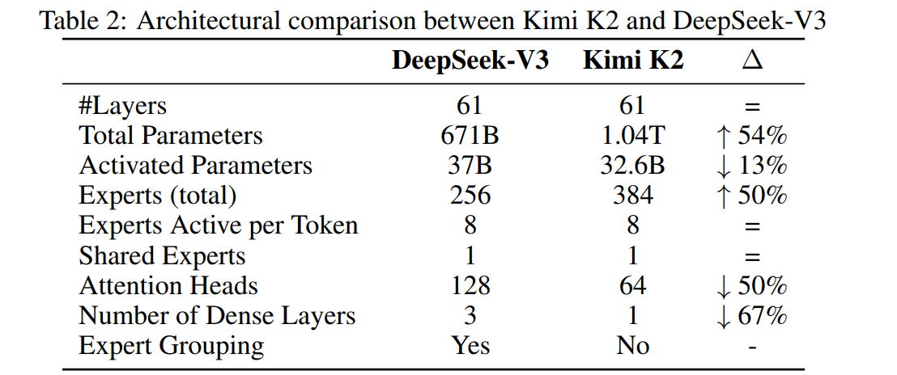
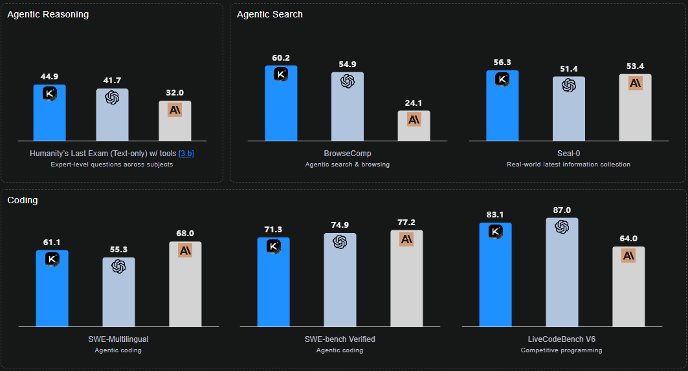
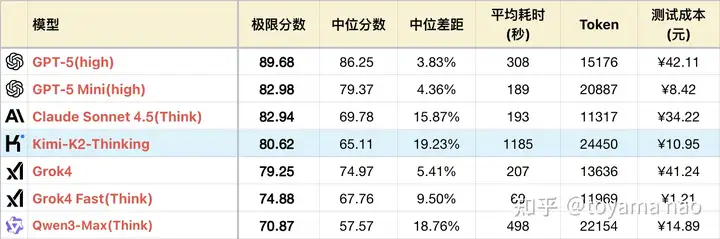

# Kimi K2模型介绍
重点强调Agent（不是coding）能力，号称能稳定执行200-300次工具调用

## 模型结构
kimi-k2总参数量1.04T，激活参数量32B；采用和DeepSeek一样的结构

## training data
预训练数据15.5T
### 数据增强：重述法

* 对知识类文本：而是换着说法再讲一遍

* 对数学类文本：改写成更易理解的 "学习笔记" 风格，还加入了多语言版本的翻译文本

### 数据合成：agetn数据

为了获得足够多、足够多样化的智能体训练数据，构建了一个大规模agent数据合成pipeline

| 方面           | 细节                                                                                         |
| -------------- | -------------------------------------------------------------------------------------------- |
| **工具库构建** | 整合 **3000+真实MCP工具** 和 **20000+合成工具** ，涵盖搜索、代码执行、API调用等功能 [137] 。 |
| **验证器经济** | 基于LLM的验证器审查智能体生成的行动和输出，确保训练数据的质量和正确性 [179] 。               |

## infra
采用MuonClip优化器，借助 MuonClip 优化器，整个预训练过程没有loss spike

tp16, ep16, zero-1, batchsize 67M

context-legnth：k2-thinking: 256k

对 MoE up_proj、SwiGLU 输入使用 FP8格式

# INT4 QAT
在post-training阶段使用

## why QAT?
[kimi员工在知乎的回答](https://www.zhihu.com/question/1969558404759544488/answer/1970539327902679960)

> 我们内部也验证了在4-bit这个精度下，PTQ可以做到在我们能观测到的所有benchmark上近乎无损。然而，当进入K2-Thinking的研发阶段，这个结论被推翻了：随着模型的生成长度变得越来越长，我们原本的block FP8推理精度和INT4 PTQ的结果呈现出了统计意义上的明显差别。一个可能的原因是随着decoding计算次数的增加，量化产生的误差被不断累积了。
> 
> 此外，我们还观察到了INT4 PTQ的另一个劣势：依赖校准集。我们测试了一些在训练集中出现过，但未在PTQ校准集中出现的case，发现FP8模型可以很好地背诵下这些训练数据，而量化后的模型则会换一种表述方式甚至遗忘相关的内容。关于这个问题目前的大致猜测是当moe非常稀疏时，尽管我们已经用了较大规模的校准数据，仍然会有部分专家只被路由到了少量token，进而导致这些专家的量化结果产生明显的“失真”。

## Why W4A16?
[kimi员工在知乎的回答](https://www.zhihu.com/question/1969558404759544488/answer/1970539327902679960)
> Kimi-K2的MoE部分稀疏度达到的1/48，在我们当前的硬件环境下，decoding 阶段 MoE 算子几乎必然 memory-bound ... 因此，在decoding阶段，W4A16量化的推理延迟是要显著优于W8A8的。

## 实现细节

1. 仅量化`routed expert`：不量化`attn`、`MLP`、`shared_expert`
2. **Fake Quant + STE**：保留保留原始 BF16 参数，梯度也是BF16

3. 量化粒度：W4A16G32，对称量化

## 精度表现
[kimi员工在知乎的回答](https://www.zhihu.com/question/1969558404759544488/answer/1970539327902679960)
>这套QAT方案可以在整个post-training阶段不改变任何训练配方，不增加任何训练token数的前提下实现近乎无损。具体反映在loss有非常非常微小的gap，而benchmark分数保持一致。

## 性能表现

推理速度提升约2倍（应该是低负载下）

## side effect

INT4精度下，推理框架和训练框架forward结果的差异性（Discrepancy)会明显比bf16更小

## 实测结果
如下表所示，kimi-k2-thinking在32k和240k上下文长度下精度差异巨大，说明该模型偏爱超长推理长度。

| model             | gpqa  | ceval | lcb_code | math  | mmlu-pro |
|-------------------|-------|-------|----------|-------|----------|
| Minimax-M2    | 79.8  | 82.86 | 73.00    | 77.67 | 82.30    |
| DeepSeek-R1 | 69.19 | 92.27 | 80.5 | 95.67 | 83.93 |
| K2-thingking(32k) | -     | 90.29 | 66.67    | 90.67 | -        |
| K2-thingking (240k)| 84.85 | 91.2  | -        | 95.00 | -        |

下图为知乎用户自己的测试结果，这些模型的耗时对比也验证了这一结论。

