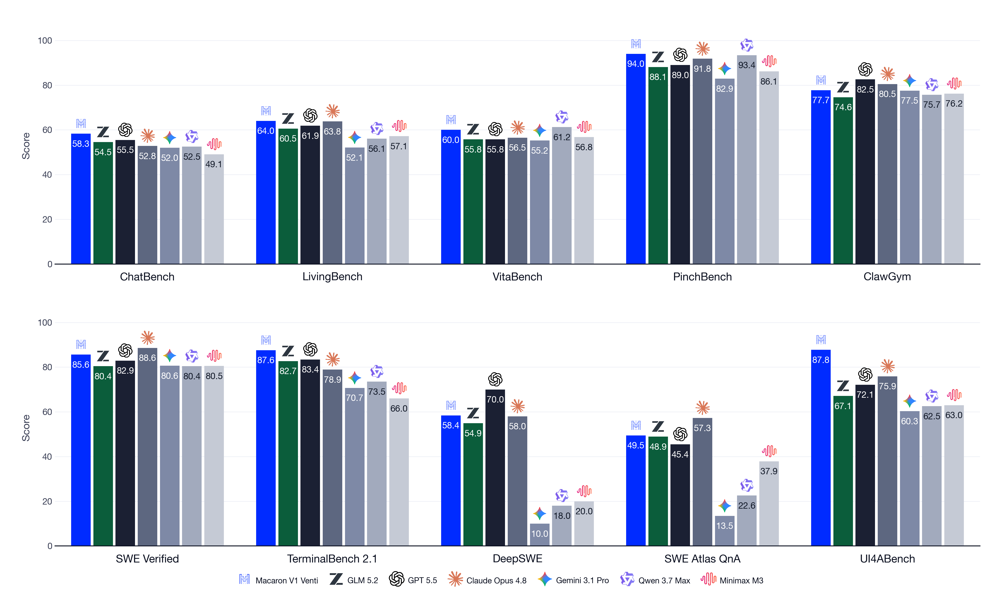
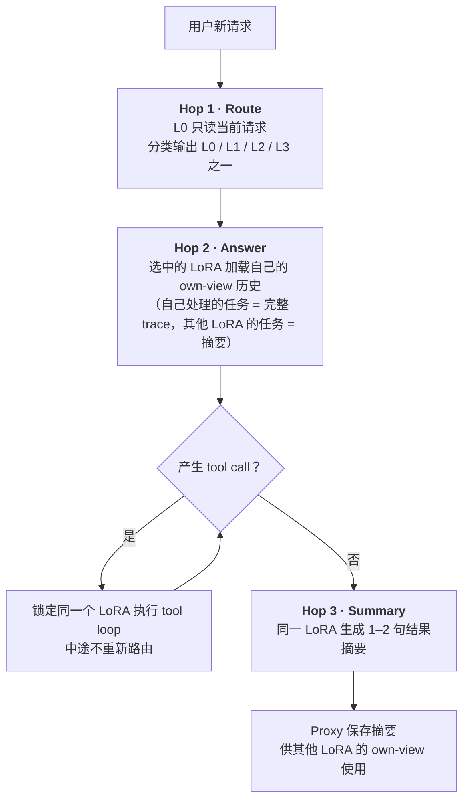

<!--
写作定位：面向大模型算法、训练与推理系统工程师，重点分析 Macaron-V1 的 LoRA/MoL 设计，不重复产品宣传口径
资料截止日期：2026-07-29
证据分级：“已披露”表示官方文章或开源代码直接支持，“实测统计”表示直接解析发布 checkpoint 的 config 和 safetensors header，“判断”表示基于公开证据的工程推断
-->

# Macaron-V1 LoRA 方法调研

## TLDR

[Macaron-V1](https://macaron.im/zh/mindlab/research/introducing-macaron-v1) 的 Mixture-of-LoRA（MoL）= 冻结的 base model + 四个职责不同的 LoRA（Chat / Agent / Coding / GenUI）+ 一次 request-level 路由。每个新请求先被分类到其中一个 LoRA，之后整个 reasoning 和 tool loop 只启用它，直到下一个request。

本质上，这是一套 harness 级 lora policy 管理系统，不是新的 LoRA 算法：

- **价值在哪**：adapter 生命周期管理。能力隔离、RL policy 版本，不同任务更新各自的参数，从而隔离优化冲突。也即官方所说的“参数空间正交化”
<!-- - **LoRA 有多大**：远超官方“1B”口径给人的直觉。V1 公开 adapter 为每层全部 256 个 routed experts 保存了 LoRA tensor，实测单文件含 7.688B 个 BF16 标量、15.4 GB，官方口径与发布文件对不上（详见「参数实查」）。Tall 单 adapter 含 3.776B 个标量，约为 35B base 的 10.8%；两个版本约 98% 的 adapter 参数都来自 routed experts -->

**注意**：截至 2026-07-29，Macaron-V1的Technical Report 仍为 `coming soon`状态，当前分析仅基于blog和开源代码。

## 模型和 LoRA 布局

V1 发布了两个模型： [Venti](https://huggingface.co/mindlab-research/Macaron-V1-Venti) 和 [Tall](https://huggingface.co/mindlab-research/Macaron-V1-Tall)

| 项目                  | Macaron-V1-Venti                                            | Macaron-V1-Tall                                 |
| --------------------- | ----------------------------------------------------------- | ----------------------------------------------- |
| Base model            | GLM-5.2                                                     | Qwen3.6-35B-A3B                                 |
| Base 结构             | 78 层，前 3 层 dense MLP，后 75 层 MoE，256 experts / top-8 | 40 层 hybrid attention MoE，256 experts / top-8 |
| Adapter               | L0–L3 四个 rank-**16** LoRA                                 | L0–L3 四个 rank-**64** LoRA                     |
| LoRA scaling          | `alpha=32`，`alpha/r=2`                                     | `alpha=128`，`alpha/r=2`                        |
| 官方 adapter 参数口径 | 1B / adapter                                                | 3.7B / adapter                                  |
| 实际 adapter 参数     | 7.688B / adapter                                            | 3.776B / adapter                                |

<!-- 表中 base 结构来自发布 checkpoint 的 [`config.json`](https://huggingface.co/mindlab-research/Macaron-V1-Venti/blob/main/config.json)，LoRA rank、alpha 和 target 则来自各 adapter 的 [`adapter_config.json`](https://huggingface.co/mindlab-research/Macaron-V1-Venti/blob/main/loras/L0/adapter_config.json)。表中“实际可数标量”通过官方 safetensors header 内所有 tensor shape 的乘积求和得到，计算过程独立于文档口径 -->

四个 adapter 的职责如下

| Adapter   | 职责                                                |
| --------- | --------------------------------------------------- |
| L0 Chat   | 通用对话、instruction following，同时是 router 入口 |
| L1 Agent  | 长时程、重工具使用、个人生活和动态工作流            |
| L2 Coding | 代码理解、repo 修改、SWE 和 terminal                |
| L3 GenUI  | UI4A/A2UI 渲染和 UI-driven action                   |

与 [Macaron-V1-Preview](https://macaron.im/mindlab/research/macaron-v1-preview) 相比，V1 从 GLM-5.1 切到 GLM-5.2，并从五个 LoRA 缩为四个，原 L1 personal-life 和 L4 OpenClaw 合成了更通用的 L1 Agent

## 为什么要拆成多个 LoRA

减少 multi-task post-training 中的 optimization interference。Chat、tool use、coding 和 GenUI 的数据形态、chain-of-thought 与 reward 目标不同，全部更新同一份参数时，某一类任务的增益可能破坏另一类能力。MoL 的做法是：相似任务放进同一 adapter，差异较大的任务拆开，从参数更新边界上隔离冲突

这个设计有三个好处

- Base 和已有 adapter 不被新能力覆写，新 domain 可以以新 LoRA 和路由元数据的形式接入
- 不同 specialist 可以使用不同数据、reward 和更新节奏，回滚也只需替换某个 adapter revision
- Actor/learner 共享常驻 base，训练—推理边界只传输 adapter，对 744B base 仍有很大交付收益

## 其他LoRA 细节

未使用 DoRA、RSLoRA 和 QLoRA。算法层就是标准 LoRA，排除了：`gate`、`shared_expert_gate`、`lm_head`

### 参数实查：官方“1B”口径与发布文件对不上

各 adapter 的实际参数与文件体积如下：

| Checkpoint          | Tensor dtype |      参数量 | Routed-expert 参数量 | Routed-expert 占比 |  文件体积 |
| ------------------- | -----------: | ------------: | -----------------: | -----------------: | --------: |
| Venti L0–L3，每个   |         BF16 | 7,688,042,496 |      7,549,747,200 |             98.20% | 15.393 GB |
| Tall L0/L1/L3，每个 |         BF16 | 3,775,651,840 |      3,690,987,520 |             97.76% |  7.551 GB |

**官方“1B LoRA”的口径与公开发布的 checkpoint 不符，应该是官方写错了**。官方 1B 的说法可能沿用了 [Preview 时代的文件规模](https://huggingface.co/mindlab-research/Macaron-V1-Preview-749B/tree/main/loras/L0)（Preview 每层只发布 32/256 个 routed expert 的 LoRA）

<!-- 由此，`744B + 4×1B = 748B` 的总参数口径同样不成立：完整四 adapter 参数池约 774.75B，单次请求激活一个 adapter 时约 751.69B。社区已有人在 [r/LocalLLaMA 发布帖](https://www.reddit.com/r/LocalLLaMA/comments/1v2k5hv/mindlabresearchmacaronv1venti_huggingface/)和 [Hugging Face discussions](https://huggingface.co/mindlab-research/Macaron-V1-Venti/discussions) 追问 `4×1B` 对应的 VRAM，官方尚未回应。部署预算应从完整文件、实际 TP/EP 布局和 adapter cache 策略推导，不要用官方 1B 口径 -->

另外，Tall L2 的 header 显示全部 3.776B 标量均为 F32，而 model card 将整个 checkpoint 概括为 BF16。这两个问题都可以认为是官方的疏忽。

<!--
参数实查方法：通过 HTTP Range 只读取 adapter_model.safetensors 的 8-byte header length 和 JSON header，对除 __metadata__ 外的每个 tensor 计算 prod(shape) 并求和，未下载完整权重
Venti L0 header：116448 tensors / 7688042496 BF16 elements
Venti L0 routed experts：115200 tensors / 7549747200 BF16 elements
Preview L0 header：15650 tensors / 1084590080 BF16 elements
Preview L0 routed experts：14400 tensors / 943718400 BF16 elements；每层 expert ids 为 0,8,...,248
Tall L0 header：780 tensors / 3775651840 BF16 elements
Tall L2 header：780 tensors / 3775651840 F32 elements
-->

## MoL 怎么路由

开源 [Mixture-of-LoRA-Harness](https://github.com/MindLab-Research/Mixture-of-LoRA-Harness) 把一次完整请求拆成 route、answer、summary 三个 model hop，只有 answer 会返回给用户

### Route hop

L0 同时是 Chat specialist 和 router。路由过程分三步：Proxy 将当前 user request 与 [`route.md`](https://github.com/MindLab-Research/Mixture-of-LoRA-Harness/blob/main/mol_harness/Macaron-V1-Venti/route.md) 中的分类规则组合，以 `model_id=` 作 assistant prefill，再用 structured output 把解码约束到 L0–L3 中的一个 label。默认 `temperature=0`、路由 decode budget 是 24 tokens。正常模式完全信任 L0 输出，旧的关键词 scorer 只保留为 legacy mode，实现见 [`proxy.py`](https://github.com/MindLab-Research/Mixture-of-LoRA-Harness/blob/main/mol_harness/proxy.py)

两个性质值得注意。第一，这个 router 是 harness 中的离散 control hop，误差不会通过最终任务 loss 端到端回传；每次路由给出唯一 adapter，整个 forward 使用该 adapter，因此“Mixture”的准确含义是系统层 policy selection。第二，当前实现的 route hop 只看当前原始请求，不读取前序摘要——这对意图明确的新任务很干净，但“继续刚才那个”这类指代型 follow-up 可能因缺少历史而误路由，开源 prompt 对含糊请求默认选 L2 只能提供经验性 fallback

### Answer 和 tool stickiness

选中 Lx 后，当前 task 的 reasoning、answer 和多轮 tool call 都继续使用 Lx。工具返回时 Proxy 记录 `pending_tool_route=Lx`，跳过重新路由，避免一个未完成 trajectory 中的 policy 来回切换

### 跨 LoRA 上下文

每个 specialist 都有 own-view：它自己处理过的 task 保留完整 user/tool/assistant trace，其他 specialist 完成的 task 只保留原始 user request 和 1–2 句结果摘要，代码见 [`session.py`](https://github.com/MindLab-Research/Mixture-of-LoRA-Harness/blob/main/mol_harness/session.py)

这种共享使用 context 传递。各 LoRA 的参数保持独立，每次推理只加载选中的一个 specialist。V1 的已公开证据覆盖了摘要式 context 协作，官方所说的 Collective Intelligence 仍处于后续扩展阶段

<!-- 代价是 multi-task 问题并没有消失，而是集中到任务 clustering、router 和跨 adapter 摘要三个环节。L1 合并 personal-life 与 OpenClaw 就是一个典型取舍：adapter 数量更少、通用性更强，但 L1 内部的数据与 reward 冲突也可能增大 -->

## infra

### 数值 一致性

使用R3来避免train/rollout选到不同expert，还用 IcePop-style ratio band 将不可信 token 的 importance weight 置零（而不是TIS）

### V1 不再沿用 Preview 的跨 LoRA KV 复用

Preview 文章曾写明，LoRA 切换会改变 attention 并使原 KV cache 失效，当时的方案是继续使用旧 cache 并接受一定精度损失。V1 开源实现已换成更干净的 per-LoRA 策略：每个 specialist 的 own-view prefix 按确定规则重建，再次进入该 LoRA 时前缀保持 byte-identical，由 engine 的 LoRA-aware prefix cache 命中，不需要把 Lx 生成的 KV 直接拿给 Ly

### 三个 hop 带来的成本

普通无工具请求需要 route、answer、summary 三次 model call，只有 answer 返回给用户。Route 的 decode 很短，summary 默认最多 192 tokens，但两者仍然带来额外 prefill、decode 和调度延迟

但官方没有公开 router 准确率、route/summary 的 TTFT 占比、prefix-cache hit rate、跨 LoRA 切换率或摘要丢失导致的任务失败率

<!-- ## 工程判断 -->

<!-- ### 值得借鉴的部分

- 用 adapter 边界表达 policy 边界，将能力开发、版本回滚和 serving 统一到同一个可管理对象
- 路由作为显式 control hop，可在内部 trace 和日志中审计，比隐藏 router network 更容易调试、改规则和做线上归因
- Tool stickiness 确保一个 agent trajectory 不会在中途切 policy，是比“每个 message 都重路由”更稳定的状态机
- Per-LoRA own-view 兼顾了正确的 KV 边界和 prefix-cache 利用，比 Preview 直接跨 LoRA 复用 KV 更可靠
- MinT 把 adapter-only handoff、MoE route replay、distributed export 和 multi-LoRA cache 都做成了系统能力，这部分的工程含金量高于 MoL 命名本身 -->

<!-- ### 主要风险和边界

- Router 是单点误差源，且只看当前 request，对含糊 follow-up 和跨 domain 任务容易选错 specialist
- 三 hop 结构把单次对话变成至少三次模型调用，官方尚未公开这部分的端到端 latency 与 GPU 成本
- 跨 adapter 信息只靠 1–2 句摘要传递，长时程任务中的约束、失败现场和 tool provenance 可能丢失
- LoRA 的绝对体积不小，尤其 Tall 的单 adapter 约占 base 10.8%，四 adapter 驻留、CPU cache、HBM slot 和冷加载仍需要认真设计
- Adapter 只与特定 base revision 兼容，Preview 从 GLM-5.1 迁到 V1 的 GLM-5.2 也说明“不改 base 就可持续学习”只在 base 版本固定时成立
- 开源 Venti launcher 将 context 限制在 262K，低于 checkpoint 和 model card 的 1M，自托管时不能直接把模型能力上限当作默认服务能力
- Venti 的 1B 口径缺少官方定义，部署预算应从完整文件、实际 TP/EP 布局和 adapter cache 策略推导；Tall L2 dtype 也需要独立核对转换路径和精度回归 -->

<!-- ## 未披露信息

截至 2026-07-29，[Venti model card](https://huggingface.co/mindlab-research/Macaron-V1-Venti) 将 Macaron-V1 Technical Report 标注为 `coming soon`，完整 benchmark methodology 也计划随报告发布，下列信息无法从当前公开材料复现

- 每个 LoRA 的 SFT/RL 数据规模、数据配比、去污染方法和训练 token 数
- Optimizer、learning rate、batch size、训练 step、梯度策略和 rank 16/64 的选择依据
- L0 router 的训练数据、分类准确率、混淆矩阵和 adversarial routing 结果
- 四个 adapter 是否完全独立初始化、是否共享某个 SFT adapter 起点，以及它们的实际训练先后关系
- Universal LoRA、merged multi-task LoRA、oracle-routed MoL 和实际 L0-routed MoL 的同 compute ablation
- Summary 长度、own-view 策略、tool stickiness 和 prefix caching 对质量、token 消耗和 latency 的单项影响
- Venti “1B LoRA”是否指 EP=8 单 rank 本地参数，以及官方 748B 总参数是否混用了全局与本地口径 -->

<!-- ## 建议的复现与验证顺序

1. 先用 Tall 复现 native multi-LoRA serving，核对四个 adapter 能否在相同 prompt 下产生明显可分的专项行为，同时确认 L2 F32 的实际加载 dtype 和 HBM 占用
2. 为四类任务构造平衡路由集，分别跑 oracle route、L0 route 和单 universal LoRA，将 specialist 能力与 router 误差拆开
3. 采集 route、answer、summary 三个 hop 的 prompt tokens、cached tokens、TTFT、TPOT 和 GPU time，与 merged L2 及单 LoRA serving 做端到端对比
4. 对跨 domain 多轮任务做 full-history、own-view summary、无摘要三组 ablation，重点观察约束丢失和错路由
5. 在相同总 token 和总训练 FLOPs 下比较 one-LoRA 与 four-LoRA，否则无法区分能力隔离收益与额外参数/数据带来的收益 -->

<!-- ## 总结

Macaron-V1 的 MoL 是一个完整的 adapter-native agent 架构：用大容量 LoRA 隔离 post-training policy，用 L0 做 request-level hard routing，用 own-view 和摘要传递跨 specialist 状态，再用 MinT 完成 adapter-only RL 训练、交付和 serving。其工程价值集中在 policy 隔离和系统生命周期

当前证据能确认这套系统在多个领域相对 base model 有提升。收益来源还需要 technical report、路由指标和同 compute ablation 来区分 MoL 拆分、额外训练与 harness 的贡献。根据现有证据，Macaron-V1 的准确定位是“可部署的多 LoRA policy 系统”

## 消息来源与证据状态

本报告优先使用以下一手材料，并将各来源限制在它能够支持的结论范围内。正文中的陈述已通过 inline link 指向对应来源

- [Macaron-V1 官方发布文章](https://macaron.im/zh/mindlab/research/introducing-macaron-v1)：版本定位、四个 specialist 的职责、官方参数口径、LongStraw、MinT、MindForge 和 benchmark 汇总
- [Venti model card](https://huggingface.co/mindlab-research/Macaron-V1-Venti) 与 [Tall model card](https://huggingface.co/mindlab-research/Macaron-V1-Tall)：模型配置、部署入口、evaluation artifacts、Technical Report 状态和 checkpoint 文件索引
- Venti 的 [`config.json`](https://huggingface.co/mindlab-research/Macaron-V1-Venti/blob/main/config.json)、[`adapter_config.json`](https://huggingface.co/mindlab-research/Macaron-V1-Venti/blob/main/loras/L0/adapter_config.json) 和 adapter safetensors header：层数、expert 数、LoRA rank、target modules、tensor shape、dtype 与全局参数实测
- [Macaron-V1-Preview-749B adapter](https://huggingface.co/mindlab-research/Macaron-V1-Preview-749B/tree/main/loras/L0)：每层仅含 32/256 个 expert LoRA、疑似 EP=8 单 shard 的 expert id 分布和约 1B 参数口径线索
- [Mixture-of-LoRA-Harness](https://github.com/MindLab-Research/Mixture-of-LoRA-Harness)：request-level routing、tool stickiness、own-view summary、vLLM/SGLang 启动参数和 runtime 行为
- [MinT 论文](https://arxiv.org/abs/2605.13779)：adapter-only handoff、MoE expert LoRA 的 TP/EP ownership、distributed export、R3 和 adapter cache
- [r/LocalLLaMA 的 Venti 发布帖](https://www.reddit.com/r/LocalLLaMA/comments/1v2k5hv/mindlabresearchmacaronv1venti_huggingface/) 与 [Hugging Face discussions](https://huggingface.co/mindlab-research/Macaron-V1-Venti/discussions)：社区对 `4×1B`、VRAM 和部署条件的反馈，只用于判断公开争议和待确认问题

Technical Report 尚未发布，因此官方文章和 model card 属于 release-level disclosure。报告中的 checkpoint 参数统计标为“实测统计”，EP=8 对 1B 口径的解释标为“判断”，benchmark 只按官方披露结果引用 -->
