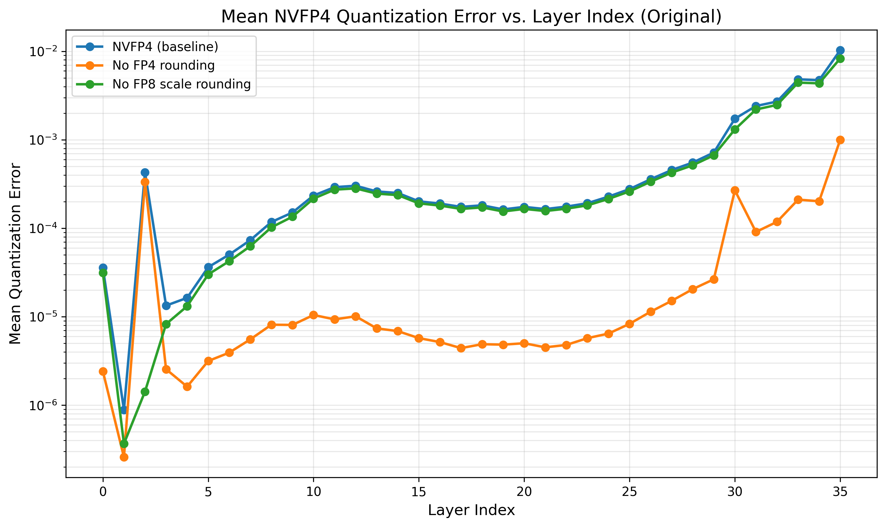
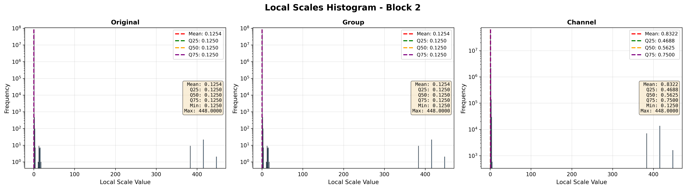

# 深入剖析NVFP4：为何Hadamard变换惨遭滑铁卢？

## 引言
作为NVIDIA为B系列显卡原生支持的4比特浮点格式，NVFP4正成为LLM推理领域一个不可忽视的趋势。

然而，实践表明，许多主流的量化方法在NVFP4上却收效甚微，甚至出现性能倒退。本文将结合实验，深入剖析被寄予厚望的Hadamard变换为何会“水土不服”。

## NVFP4 基础介绍
与传统的低精度量化方案不同，NVFP4采用了一种极为精细的设计：GroupSize为16，并引入了两级缩放因子（scale）。

对于一个shape为`[M, N]`的 tensor，量化后的结构如下：

| name         | shape          | dtype      |
| ------------ | -------------- | ---------- |
| weight       | [M, N//16, 16] | fp4_e2m1   |
| local_scale  | [M, N//16]     | fp8_e4m3fn |
| global_scale | [1]            | fp32       |

## Hadamard变换：从“最优选择”到“效果倒退”
[FP-Quant](https://github.com/IST-DASLab/FP-Quant) 的研究指出，对于 NVFP4，GroupSize 为 16 的 Hadamard 变换是理论上的最佳选择。
然而，在我们的实验中，无论是 Qwen2.5-B-Instruct 还是 Llama-3.1-8B，都无法复现这一结论。恰恰相反，一旦进行Hadamard变换，不管是weight还是activation，模型精度都会出现明显下降。

### 相对量化损失 vs. 绝对量化损失
[FP-Quant](https://github.com/IST-DASLab/FP-Quant) 论文采用相对均方误差（Relative MSE）作为量化损失的评估指标，从而推导出GroupSize=16的Hadamard变换是最优的。

下图复现了这一分析，其中横轴是Qwen2.5-3B-Instruct的层数，纵轴是activation的量化损失。
可以看到对于相对量化损失（定义为 $(\frac{w-w_q}{w})^2$），Hadamard变换（无论 GroupSize 为何值）均能有效降低该损失，并在 GroupSize=16 时达到最小值。
然而，这一发现与模型精度评测结果相悖：RTN 方法虽然相对量化损失最高，但模型精度却是最佳的。

*图中 G 表示 GroupSize*

而下图为绝对量化损失。可以看到不进行Hadamard变换时损失最低，且量化损失随着Hadamard变换 GroupSize 的增大而增大。该结果与模型精度评测结果一致。**因此，在NVFP4的场景下，绝对MSE是比相对MSE更可靠的量化效果评估指标**。
推测是因为更大的activation，其实对模型的影响也更大，而不能仅从相对误差的角度分析。

从下图中也可以看出来，不管GroupSize如何变化，只要有Hadamard变换，量化损失就会变高。

*图中 G 表示 GroupSize*

### NVFP4 量化误差拆解
那么，为何Hadamard变换（无论 GroupSize 大小）反而会增大最终的量化误差呢？下面将从构成量化误差的 rounding error 和 scale 两方面进行分析。

#### Scale 分布
下图展示了 activation 量化后的 scale 分布。由于 NVFP4 包含两个 scale，分析较为复杂，可以直接关注第三行展示的 per-group-max 统计结果。从均值上看，per-channel Hadamard变换不改变 group 内部的动态范围，而 group-wise Hadamard变换则能显著将其动态范围压缩至原先的四分之一。
理论上，更低的动态范围意味着更小的量化误差。因此，单从scale的角度看，group-wise旋转似乎是最佳选择。

*Scale分布情况*

#### Scale fp8 rounding error 分析
由于`local_scale`是fp8量化的，因此也存在量化误差。那么fp8量化误差有多大呢？它与fp4权重的量化误差相比是大还是小呢？

如下图所示，绿色的线表示不做`local_scale`的fp8量化，橙色的线表示不做权重的fp4量化。

*FP4权重与FP8 Scale的量化误差对比*

结论：
1. 在绝大多数层中，fp4 activation的量化误差占主导地位，通常比fp8 scale的量化误差高一个数量级
2. 在第2层出现了反常，fp8的量化误差反而更低。结合该层极度不均匀的`local_scale`分布（如下图所示），可以合理猜测，此时存在少量异常大的`local_scale`值，导致其他正常的`local_scale`被压缩到极小的数值范围，使得fp8格式中间一大片表示能力都被浪费了。

既然`local_scale`的fp8量化误差并非主要矛盾，那么问题的根源，必然出在占主导地位的fp4 tensor自身量化上。因此，我们接下来将矛头直指Rounding Error。
   

#### Rounding Error 分析
下图统计了不同GroupSize的Hadamard变换后，量化到 NVFP4 格式后各数值的分布。对于原始 activation，大量数值落在量化误差最小的 `[0, 2]` 区间。
但经过Hadamard变换后，原本集中在0附近、呈现Laplace长尾分布的数值，在变换后转变为双峰分布，导致更大部分的数值落在了量化误差更大的 `[2, 4]` 区间。

*不同GroupSize下量化后数值分布*

因此，尽管RTN(不进行Hadamard变换)在scale上可能引入了更大的误差，但其在Rounding Error上的优势足以弥补这一点，从而在整体上获得了更低的总量化误差。

总结来说，Hadamard变换对activation分布带来了以下改变：
1.  **动态范围变小，峰度（kurtosis）降低。**
2.  **部分原本极小的数值被放大。**

正是这两个特性，使得Hadamard变换与NVFP4的数据特性“八字不合”。

或者换个角度，是否存在一种线性变换，能够反过来让数据分布变得更加长尾，从而更好地适应 NVFP4 的特性呢？

AI给出的结论很明确：不存在这样的通用线性变换。其原因是：
1.  降低峰度的操作可以通过线性的平均化和白化操作实现。
2.  而提升峰度的操作则受到线性变换守恒性质的制约——线性变换无法摆脱中心极限定理的影响，总是倾向于使数据分布趋向正态分布。

## 其他尝试
除了Hadamard变换，我们还尝试了其他主流的量化算法。实验发现，目前只有SmoothQuant能在NVFP4上带来微弱的精度提升，但距离BF16的精度水平仍有较大差距。
至于GPTQ等其他方法，则基本无效。

## 结论与思考
NVFP4给人一种“返璞归真”的感觉。最简单的RTN（Round-To-Nearest）方法，反而获得了最佳的效果，不需要花里胡哨。

那么，4Bit量化的极限就真的止步于此了吗？我们是否还能找到更优的方法来驾驭NVFP4？或者说，是否存在某个理论，能够帮助我们预判一个模型在特定精度阈值下，所能达到的量化比特数的极限？这些问题，仍有待进一步探索。

