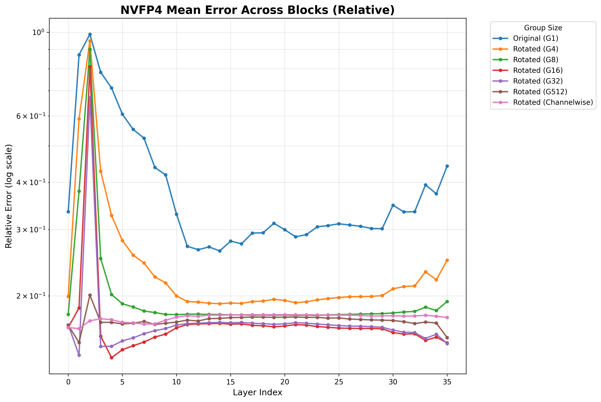
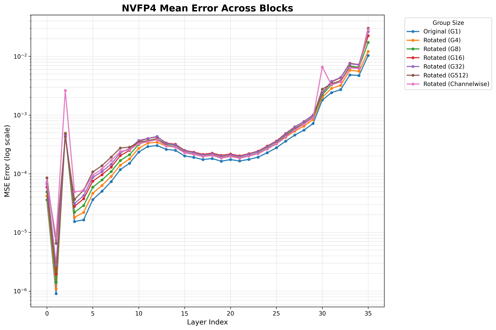
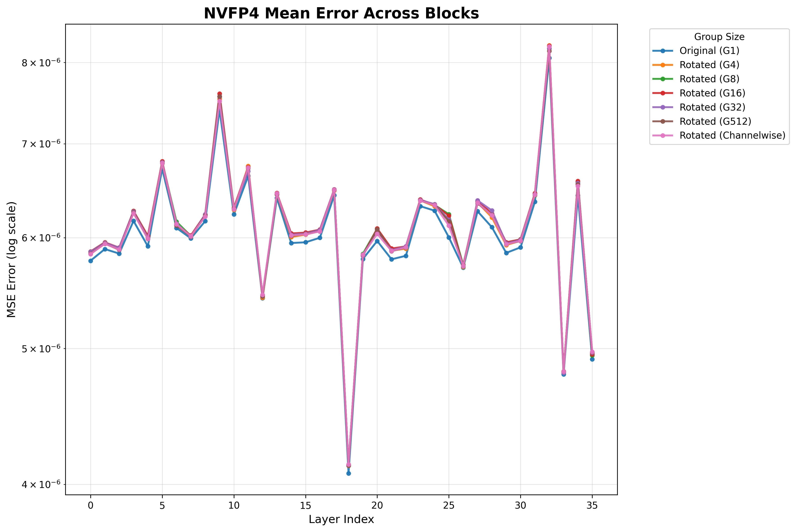
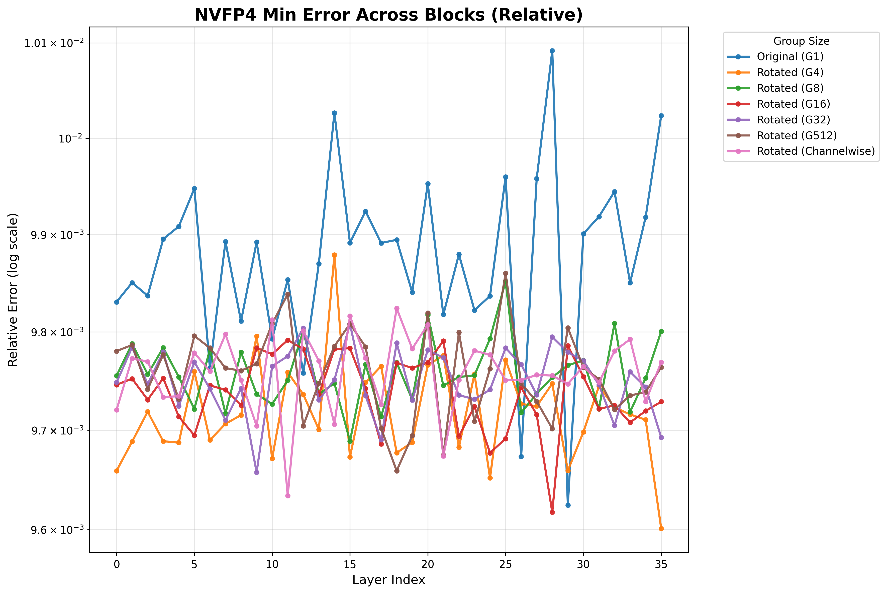
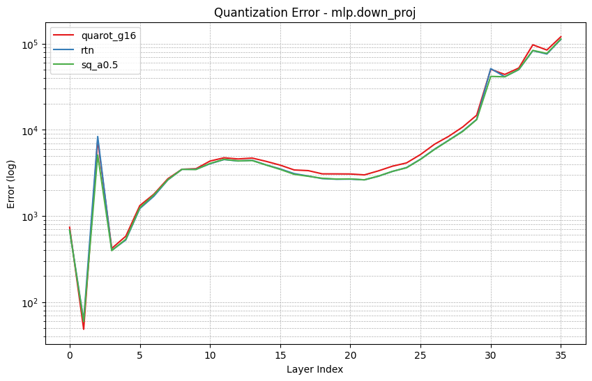
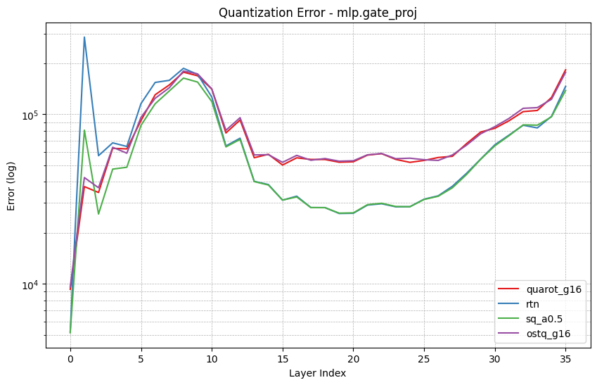
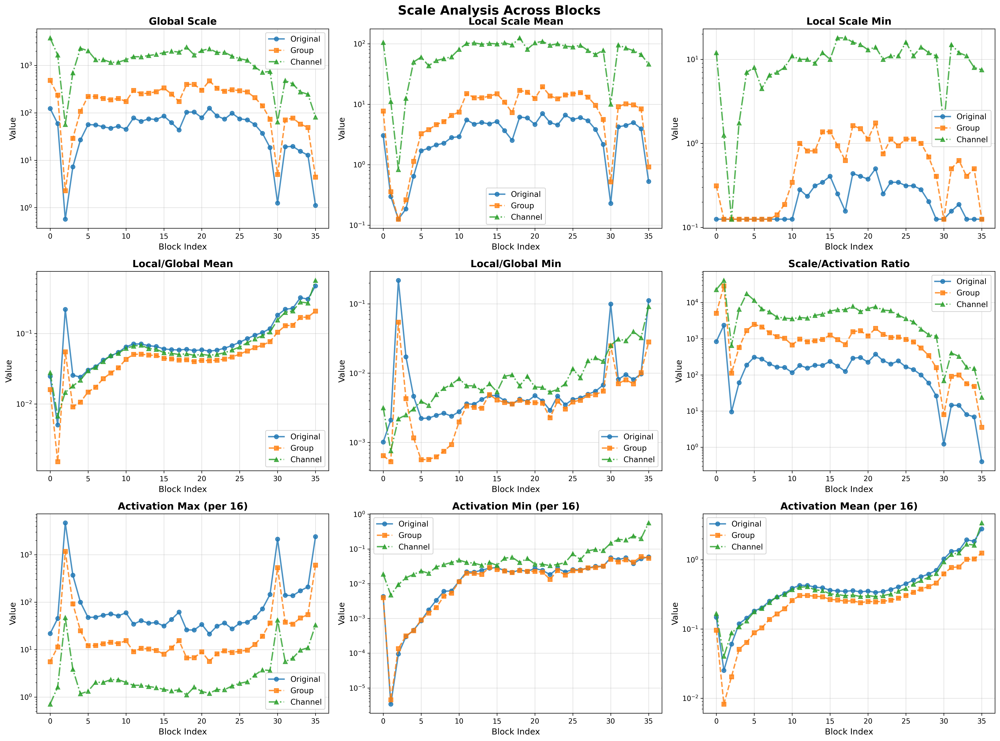
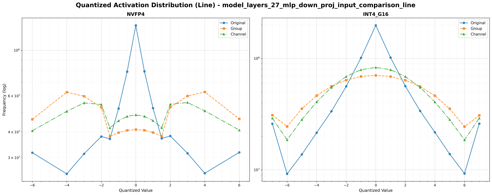
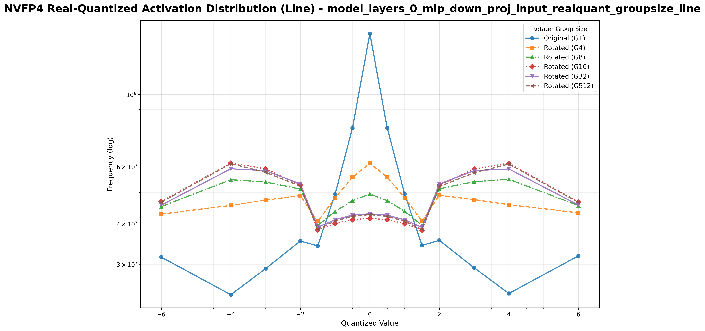

# NVFP4 量化技术阶段性总结 (2025-10)
本文所有分析均基于 Qwen2.5-3B-Instruct 模型，若无特殊说明，默认不采用在线旋转（Online Rotation）。

## 核心结论
综合全文实验，对于 NVFP4 数据类型：
- **有效的方法**：
    1.  **RTN**：作为基准方法，表现稳健且优于多种复杂方法。
    2.  **SmoothQuant**：可以带来轻微的精度提升。
    3.  **MSE Weight Clipping**：可以带来约 1% 的精度提升，且能与 SmoothQuant 叠加使用。
- **无效/负优化的方法**：
    1.  **旋转变换（QuaRot / Hadamard）**：所有测试的旋转方法均会导致精度显著下降，不适用于 NVFP4。
    2.  **GPTQ**：在 RTN 或 SmoothQuant 等强基线上几乎无效，甚至会损害精度。其主要作用仅限于部分挽回旋转方法造成的精度损失。

## 1. 前期实验总结
如下表所示，在前期实验中，发现对于 NVFP4 数据类型，一些以往有效的量化方法（如 QuaRot 和 GPTQ）的精度结果均未能超过基准的 RTN（Round-to-Nearest）方法。值得注意的是，QuaRot 预处理甚至对最终精度产生了负面影响。

| preproc | method | precision | MMLUPRO | GPQA | Math_500 | lcb_code | LongBenchv2 | CEVAL | AVG | AVG2 |
| --- | --- | --- | --- | --- | --- | --- | --- | --- | --- | --- |
| - | - | BF16 | 44.81 | 25.76 | 63.67 | 29.00 | 33.33 | 70.31 | 44.48 | 46.71 |
| - | RTN | NVFP4 | 38.11 | 24.75 | 56.33 | 18.50 | 34.29 | 63.45 | 39.24 | 40.23 |
| quarot | RTN | NVFP4 | 26.16 | 23.23 | 36.33 | 5.00 | 28.57 | 51.99 | 28.55 | 28.54 |
| - | gptqv2 | NVFP4 | 39.51 | 30.30 | 53.00 | 18.50 | 36.19 | 62.48 | 40.00 | 40.76 |
| quarot | gptqv2 | NVFP4 | 34.65 | 27.27 | 44.67 | 13.50 | 30.48 | 59.02 | 34.93 | 35.82 |

## 2. Group-wise Hadamard 变换效果分析

<mark>核心发现：目前测试的所有旋转方法，无论是随机 Hadamard 矩阵还是通过 OSTQuant 学习的旋转矩阵，其最终模型精度均低于简单的 RTN 量化。</mark>

[FP-Quant](https://github.com/IST-DASLab/FP-Quant) 指出，对于 NVFP4，group-size 为 16 的 Hadamard 变换是最佳选择。然而，在 Qwen2.5-3B-Instruct 和 Llama-3.1-8B 模型上的实验无法复现此结论。如下表所示，虽然 group-wise 旋转相比 per-channel 旋转展现出更好的性能，但其精度仍然不及 RTN。

| preproc | method | precision | rotate size | MMLUPRO | GPQA | Math_500 | lcb_code | LongBenchv2 | CEVAL | AVG | AVG2 |
| --- | --- | --- | --- | --- | --- | --- | --- | --- | --- | --- | --- |
| - | RTN | NVFP4 | - | 38.11 | 24.75 | 56.33 | 18.50 | 34.29 | 63.45 | 39.24 | 40.23 |
| quarot | RTN | NVFP4 | - | 26.16 | 23.23 | 36.33 | 5.00 | 28.57 | 51.99 | 28.55 | 28.54 |
| quarot | RTN | NVFP4 | 16 | 27.80 | 27.27 | 42.00 | 9.00 | 30.48 | 58.05 | 32.43 | 32.82 |
| - | gptqv2 | NVFP4 | - | 39.51 | 30.30 | 53.00 | 18.50 | 36.19 | 62.48 | 40.00 | 40.76 |
| quarot | gptqv2 | NVFP4 | 16 | 34.67 | 28.79 | 44.33 | 13.50 | 31.43 | 60.57 | 35.55 | 36.37 |

下面将从量化损失和NVFP4量化结果两个方面进行分析。

### 2.1 相对量化损失 vs. 绝对量化损失
[FP-Quant](https://github.com/IST-DASLab/FP-Quant) 使用相对 MSE（Mean Squared Error）作为量化损失的评估指标。本节将对此进行复现与分析。

#### Activation 量化损失
如下图所示，对于相对量化损失（定义为 $(\frac{w-w_q}{w})^2$），旋转操作（无论 group-size 为何值）均能有效降低该损失，并在 group-size=16 时达到最小值。然而，这一发现与前述的模型精度评测结果相悖：RTN 方法虽然相对量化损失最高，但模型精度却是最佳的。

*图中 G 表示 group-size*

反观绝对量化损失，如下图所示，不进行旋转时损失最低，且量化损失随着旋转 group-size 的增大而增大。该结果与模型精度评测结果高度一致。**这表明，至少在当前实验中，绝对 MSE 是比相对 MSE 更可靠的量化效果评估指标。**

*图中 G 表示 group-size*

#### Weight 量化损失
权重（weight）部分的量化损失也呈现出与激活（activation）类似的结论。

### 2.2 GPTQ 训练损失
下面两张图展示了 GPTQ 量化过程中 `down_proj` 和 `gate_proj` 层的训练损失。可以清晰地看到，采用 RTN 和 SmoothQuant 预处理时，GPTQ 损失更小，而旋转操作则会导致损失显著增大。

### 2.3 NVFP4 量化误差拆解
为什么旋转操作（无论 group-size 大小）反而增大了最终的量化误差？下面将从构成量化误差的 rounding error 和 scale 两方面进行分析。

#### Scale 分布
下图展示了 activation 量化后的 scale 分布。由于 NVFP4 包含两个 scale，分析较为复杂，可以直接关注第三行展示的 per-group-max 统计结果。从均值上看，per-channel 旋转不改变 group 内部的动态范围，而 group-wise 旋转则能将其动态范围降低约 75%（至 1/4）。
若其他条件不变，更低的动态范围意味着更小的量化误差，因此从scale角度看，group-wise旋转相比per-channel旋转和不旋转都更好。

#### Rounding Error 分析
下图统计了量化到 NVFP4 格式后各数值的分布。对于原始 activation，大量数值落在量化误差最小的 `[0, 2]` 区间。然而，一旦经过旋转，其数值分布便从类拉普拉斯（Laplace）的长尾分布转变为双峰分布，导致更大部分的数值落在了量化误差更大的 `[2, 4]` 区间。

因此，RTN 这种简单的量化方法，虽然由 scale 引入的误差可能更大，但其 rounding error 更小，从而在整体上获得了更低的量化误差。

那么，是否存在某个特定的 rotate size，可以取得更低的 rounding error 呢？如下图所示，答案是否定的。只要引入旋转，原本聚集于 0 的数值分布便会单调地向双峰形态转变，不存在所谓的“最优”转折点。

总结来说，旋转对数据分布带来了以下改变：
1.  **动态范围变小，峰度（kurtosis）降低。**
2.  **部分原本极小的数值被放大。**

这一特性使得旋转变换不适用于 NVFP4 数据类型。

或者换个角度，是否存在一种线性变换，能够反过来让数据分布变得更加长尾，从而更好地适应 NVFP4 呢？

AI的结论是：不存在这样的通用线性变换。其原因是：
1.  降低峰度的操作可以通过线性的平均化和白化操作实现。
2.  而提升峰度的操作则受到线性变换守恒性质的制约--线性变换无法摆脱中心极限定理的影响，总是倾向于使数据分布趋向正态分布。

## 3. MSE Weight Clipping 与 SmoothQuant
[FP-Quant](https://github.com/IST-DASLab/FP-Quant) 还发现 MSE weight clipping 是一种有效的优化手段。由于 NVFP4 存在 global 和 local 两个 scale，标准的 weight clipping 算法需要修改。FP-Quant 的论文中提到了对二者的迭代，但其开源代码仅实现了对 local_scale 的迭代。
因此，下面实验中，我自己实现了一个版本，并未反复迭代`global_scale`和`local_scale`。

实验结果如下表所示，结论：
1.  **MSE clip 确实有效**：可以带来约 1% 的精度提升。
2.  **SmoothQuant 轻微有效**：可以带来轻微的精度提升，且其效果可以与 MSE clip 叠加。

| preproc | method | precision | w. clip | MMLUPRO | GPQA_diamond | Math_500 | lcb_code | LongBenchv2 | CEVAL | AVG | AVG2 | AVG3 |
| --- | --- | --- | --- | --- | --- | --- | --- | --- | --- | --- | --- | --- |
| - | - | BF16 | - | 44.81 | 25.76 | 63.67 | 29.00 | 33.33 | 70.31 | 44.48 | 46.71 | 51.95 |
| - | RTN | NVFP4 | - | 39.27 | 29.80 | 49.00 | 18.50 | 35.24 | 63.92 | 39.29 | 40.10 | 42.67 |
| - | RTN | NVFP4 | MSE | 38.41 | 27.78 | 52.67 | 18.00 | 36.19 | 63.36 | 39.40 | 40.04 | 43.11 |
| smoothquant(0.5) | RTN | NVFP4 | - | 36.63 | 31.82 | 51.00 | 19.00 | 37.14 | 64.57 | 40.03 | 40.60 | 42.80 |
| smoothquant(0.5) | RTN | NVFP4 | MSE | 37.78 | 33.33 | 54.67 | 21.00 | 37.14 | 63.07 | 41.17 | 41.97 | 44.13 |

## 4. GPTQ 量化效果分析
下表对比了不同预处理方法下，RTN rounding 和 GPTQ rounding 的精度差异。主要结论如下：
1.  **GPTQ 能补救 QuaRot**：对于经过 QuaRot 旋转的权重，GPTQ rounding 可以有效恢复部分精度，但最终结果距离无旋转的 RTN 量化仍有较大差距。
2.  **GPTQ 对强基线无效**：对于 RTN 和 SmoothQuant 这类本身精度较高的基线，GPTQ rounding 几乎没有助益，甚至可能导致精度下降。

| preproc | method | precision | MMLUPRO | GPQA_diamond | Math_500 | lcb_code | LongBenchv2 | CEVAL | AVG | AVG2 | AVG3 |
| --- | --- | --- | --- | --- | --- | --- | --- | --- | --- | --- | --- |
| - | - | BF16 | 44.81 | 25.76 | 63.67 | 29.00 | 33.33 | 70.31 | 44.48 | 46.71 | 51.95 |
| - | RTN | NVFP4 | 38.41 | 27.78 | 52.67 | 18.00 | 36.19 | 63.36 | 39.40 | 40.04 | 43.11 |
| - | gptqv3 | NVFP4 | 38.33 | 28.28 | 52.67 | 16.50 | 38.10 | 62.67 | 39.43 | 39.69 | 42.54 |
| quarot | RTN | NVFP4 | 28.30 | 27.78 | 37.67 | 10.50 | 32.38 | 59.36 | 32.67 | 32.72 | 33.96 |
| quarot | gptqv3 | NVFP4 | 33.87 | 30.30 | 48.00 | 17.50 | 29.52 | 61.29 | 36.75 | 38.19 | 40.17 |
| smoothquant(0.5) | RTN | NVFP4 | 37.78 | 33.33 | 54.67 | 21.00 | 37.14 | 63.07 | 41.17 | 41.97 | 44.13 |
| smoothquant(0.5) | gptqv3 | NVFP4 | 38.04 | 32.83 | 56.00 | 20.00 | 33.33 | 62.75 | 40.49 | 41.92 | 44.20 |

## 5. NVINT4 与 NVFP4 对比分析
本节采用 INT4g16 模拟 NVINT4，并与 NVFP4 进行对比。所有实验均为 W4A16 配置。为降低 `GPQA_diamond` 和 `LongBenchv2` 这两个波动较大测试集的影响，建议重点关注 `AVG3` 列的平均精度。

| preproc | method | precision | MMLUPRO | GPQA_diamond | Math_500 | lcb_code | LongBenchv2 | CEVAL | AVG | AVG2 | AVG3 |
| --- | --- | --- | --- | --- | --- | --- | --- | --- | --- | --- | --- |
| - | - | BF16 | 44.81 | 25.76 | 63.67 | 29.00 | 33.33 | 70.31 | 44.48 | 46.71 | 51.95 |
| - | RTN | NVFP4 | 42.09 | 32.32 | 60.67 | 22.00 | 35.24 | 64.60 | 42.82 | 44.34 | 47.34 |
| - | RTN | INT4G16 | 41.19 | 33.33 | 60.00 | 14.50 | 30.48 | 65.34 | 40.81 | 42.87 | 45.26 |
| - | gptqv2 | NVFP4 | 43.15 | 34.34 | 59.33 | 18.50 | 32.38 | 67.00 | 42.45 | 44.46 | 47.00 |
| - | gptqv2 | INT4G16 | 42.01 | 30.30 | 54.67 | 21.00 | 36.19 | 64.73 | 41.48 | 42.54 | 45.60 |
| quarot | RTN | NVFP4 | 37.10 | 29.80 | 50.00 | 14.00 | 35.24 | 60.37 | 37.75 | 38.25 | 40.37 |
| quarot | RTN | INT4G16 | 38.67 | 27.78 | 51.00 | 16.50 | 30.48 | 64.32 | 38.13 | 39.65 | 42.62 |
| quarot | gptqv2 | NVFP4 | 40.50 | 31.82 | 57.33 | 19.50 | 31.43 | 65.30 | 40.98 | 42.89 | 45.66 |
| quarot | gptqv2 | INT4G16 | 42.34 | 24.24 | 54.67 | 21.00 | 36.19 | 65.43 | 40.65 | 41.54 | 45.86 |

实验结论如下：
1.  **数据类型与旋转的适配性**：
    *   **无旋转**：NVFP4 精度优于 NVINT4（RTN 和 GPTQ 方法）。
    *   **有旋转**：NVINT4 精度反超 NVFP4。
2.  **方法与旋转的适配性**：
    *   **RTN**：对于 FP 和 INT 类型，不旋转效果更优。
    *   **GPTQ**：对于 FP 类型，不旋转更优；对于 INT 类型，旋转与否无明显差异。
3.  **GPTQ 的作用变化**：在此对比实验中，GPTQ 不再能稳定带来精度提升。

综上所述，可以认为**旋转变换与 INT 这类数据类型更加匹配**。这一结论也与[近期字节的文章](https://arxiv.org/abs/2510.25602)的发现相符。

