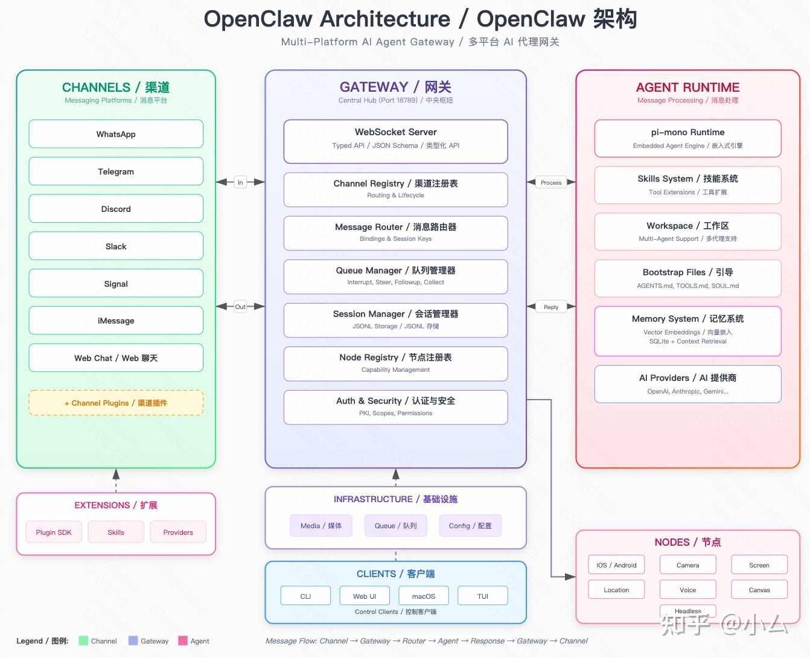
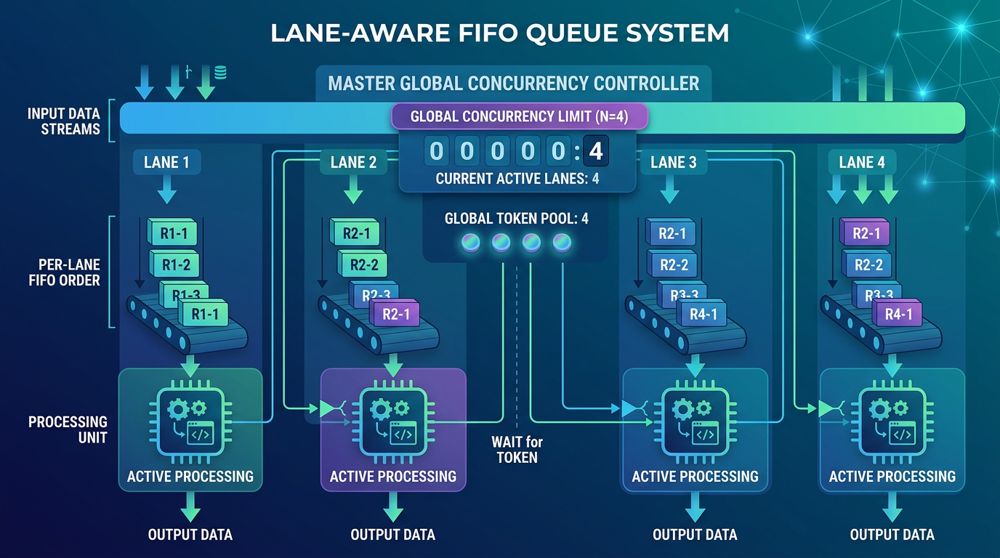

# OpenClaw 产品与技术概览

## 概述

<figure style="text-align:center;">
  
  <figcaption>OpenClaw Architecture</figcaption>
</figure>

OpenClaw 是一个开源的 **AI Agent 运行平台**，可以理解为"AI 助手的操作系统"。它的核心能力是让 AI 助手能够：

- **连接多种终端**：用户可以通过命令行、网页、macOS 客户端等方式操控 Agent；Agent 也可以控制手机（iOS/Android）、电脑等设备来执行任务。
- **接入多种聊天平台**：WhatsApp、Telegram、Discord、Slack 等主流聊天工具均可直接接入，用户在自己习惯的平台上就能与 Agent 对话。
- **智能调度**：系统会自动管理多个对话的并发，确保同一个对话中的任务按顺序执行，同时控制总体负载不超限。

---

## 技术架构概览

### 整体结构

OpenClaw 采用**单体架构 + 插件系统**的设计：

- **核心进程**：包含网关（Gateway）和 Agent 运行时（Runtime），负责接收请求、调度任务、执行 AI 对话。
- **插件系统**：功能通过插件扩展，插件以模块形式加载到核心进程中，可以灵活增减能力。
- **多渠道适配器**：Telegram、Slack、WhatsApp、Discord 等平台各有专门的适配器，统一接入核心系统。

### 核心模块

| 模块 | 功能 |
| --- | --- |
| **网关（Gateway）** | 统一的连接入口，处理所有客户端和节点的通信 |
| **Agent 运行时** | 执行 AI 对话，管理工具调用、回复生成等 |
| **记忆系统** | 让 Agent 具备长期记忆，能记住之前的对话和用户偏好 |
| **插件运行时** | 加载和管理功能插件 |
| **消息投递与流式输出** | 将 Agent 的回复实时、分段地送达各个平台 |

---

## Agent 的配置与人格设定

OpenClaw 通过一组 Markdown 文件来定义 Agent 的行为、人格和记忆。这种"用文档配置 AI"的方式非常直观，不需要写代码就能调整 Agent 的表现。

### 关键配置文件

| 文件 | 作用 | 通俗解释 |
| --- | --- | --- |
| `AGENTS.md` | Agent 的工作守则 | 类似员工手册，规定 Agent 该做什么、不该做什么 |
| `SOUL.md` | 人格与语气设定 | 定义 Agent 的"性格"，比如是严谨还是活泼 |
| `TOOLS.md` | 工具使用说明 | 告诉 Agent 有哪些工具可用、怎么用 |
| `IDENTITY.md` | 身份信息 | Agent 的名字、头像、标志性表情等 |
| `USER.md` | 用户档案 | 记录用户的称呼、时区、偏好等 |
| `MEMORY.md` | 长期记忆 | 存放经过整理的重要长期信息 |
| `HEARTBEAT.md` | 定时巡检清单 | Agent 定期自动检查的任务列表 |
| `BOOTSTRAP.md` | 首次启动引导 | 仅在第一次启动时执行的初始化流程，完成后自动删除 |

### Agent 工作守则的核心内容

`AGENTS.md` 是最重要的配置文件，它规定了：

- **启动流程**：每次会话开始时要读取哪些文件、加载哪些记忆
- **记忆管理**：重要信息要主动写入文件保存，不能只靠 AI 的"脑子记"
- **安全边界**：不泄露隐私、不擅自执行危险操作
- **外部动作策略**：查资料、整理文件等内部操作可以自主执行；发消息、发邮件等对外操作需要先征求用户同意
- **群聊礼仪**：不是每条消息都要回复，被点名或能提供有效帮助时才发言

### 权限控制

值得注意的是，上述 Markdown 文件主要影响 Agent 的"提示词层面"行为。真正的工具权限和安全边界由独立的配置文件 `openclaw.json` 控制，包括工具白名单/黑名单、不同模型的权限差异等。这种分层设计让"人格设定"和"权限管控"各司其职。

---

## 记忆系统

OpenClaw 的记忆系统让 Agent 能够"记住"过去的对话和重要信息，而不是每次对话都从零开始。

### 记忆的层次结构

记忆分为两层：

- **日志记忆**（`memory/YYYY-MM-DD.md`）：按日期记录的原始对话和事件，类似"工作日志"
- **长期记忆**（`MEMORY.md`）：经过筛选整理的重要信息，类似"知识库摘要"

所有记忆以 Markdown 文件为真正的存储载体，数据库只是为了加速检索而建立的索引。这意味着即使索引损坏，记忆内容本身不会丢失，索引可以随时重建。

### 智能检索

当 Agent 需要回忆过去的信息时，系统会同时使用两种检索方式并融合结果：

- **关键词匹配**：精确查找特定名词、命令名等——适合找"那个叫 XXX 的东西"
- **语义搜索**：理解含义后查找相关内容——适合找"之前讨论过类似问题"

此外，系统还会考虑**时间因素**（更近的记忆权重更高）和**多样性**（避免返回多条高度重复的结果），确保检索结果既相关又有用。

---

## 调度与自动化

### 任务队列：同一会话串行、跨会话限并发

OpenClaw 使用一种**分车道队列（lane-aware FIFO）** 来管理并发任务，核心思路是"两级排队"：

1. **会话车道（Session Lane）**：每个对话会话拥有自己的独立车道，车道内同一时间只允许一个任务运行。这保证了同一个用户的对话严格按顺序执行——前一条消息处理完，才会开始下一条，避免同一会话内的任务互相干扰（例如同时读写同一份会话记录或记忆文件）。
2. **全局车道（Global Lane）**：所有会话的任务在通过各自的会话车道后，还要进入全局车道排队。全局车道设有并发上限，防止同一时刻有过多任务同时调用大模型，从而避免 API 限流或系统过载。

<figure style="text-align:center;">
  
  <figcaption>OpenClaw 队列调度示意</figcaption>
</figure>

简单来说：**同一会话内的任务排成一列、逐个执行；不同会话之间可以并行，但总并发数有上限。** 这种设计在不引入复杂外部组件的情况下，保证了系统的稳定性和可预测性。

### 定时巡检（心跳）

心跳是 OpenClaw 的**周期性自动检查机制**（默认每 30 分钟触发一次）：

- 系统定期唤醒 Agent，让它检查 `HEARTBEAT.md` 中列出的待办事项
- 如果没有需要处理的事情，Agent 简单回复"一切正常"，不产生多余输出
- 在系统繁忙或静默时段，巡检可以自动跳过，节省资源

**适用场景**：周期性的例行检查，如"每隔一段时间看看有没有新邮件"

### 定时任务

定时任务调度器更加灵活，支持三种触发方式：

- **指定时间点**：如"明天下午 3 点提醒我开会"
- **固定间隔**：如"每隔 2 小时检查一次"
- **日历规则**：如"每周一早上 9 点生成周报"

定时任务有两种执行模式：
- **主会话模式**：任务融入正常对话流程，适合提醒类任务
- **独立模式**：任务在隔离环境中执行，适合不需要对话上下文的独立任务

### 心跳与定时任务的关系

两者是并列的独立机制，不是从属关系：

- **心跳**负责周期性巡检，适合"定期看看有没有事"
- **定时任务**负责精确定时执行，适合"在特定时间做特定事"
- 部分定时任务会通过心跳在主会话中执行，两者在这个场景下协同工作

---

## 安全状况

### 已披露的安全事件

2026 年初（1-2 月），OpenClaw 经历了一轮密集的安全问题披露，主要涉及：

| 风险类型 | 影响说明 |
| --- | --- |
| **远程代码执行** | 攻击者可通过恶意网页对本地运行的 OpenClaw 发起未授权控制 |
| **命令注入** | Docker 容器和 SSH 连接的命令构建存在注入漏洞 |
| **权限绕过** | 命令执行的审批机制和白名单校验存在缺陷，可被绕过 |

### 风险维度

- **技能投毒风险**：OpenClaw 的技能市场（ClawHub）是一个公开的技能注册平台，且默认开放安装。任何人都可以发布技能，而技能本质上是在 Agent 进程内运行的代码。这意味着恶意技能可以像"特洛伊木马"一样，伪装成正常功能，实际执行窃取数据、篡改 Agent 行为等恶意操作。这属于真实的**供应链攻击**风险，类似于 npm/PyPI 等包管理器中的恶意包问题。使用第三方技能时应按不可信代码对待。
  - **真实案例——ClawHavoc 事件**：2026 年 2 月，安全团队 Koi Security 披露了名为 **ClawHavoc** 的大规模供应链攻击。攻击者利用 ClawHub 仅要求 GitHub 账号注册满一周即可发布技能的低门槛机制，上传了约 **1,184 个恶意技能**，一度占据整个技能市场 12-20% 的份额。这些恶意技能伪装成生产力工具、加密货币交易机器人、WhatsApp 自动化助手等热门类别，表面上提供了宣传的功能，但暗中植入了多种恶意载荷：下载并执行远程恶意程序、建立反向连接让攻击者远程控制用户电脑、窃取 API 密钥和聊天平台凭证、记录用户输入的敏感信息等。由于技能在 Agent 进程内以完整权限运行，用户一旦安装即可能被完全控制。
- **部署风险**：2026 年初公网暴露的 OpenClaw 实例达到数万级（估计 2-4 万+）
- **总体判断**：OpenClaw 的核心安全挑战在于其强执行能力带来的攻击面——认证、审批、沙箱隔离和本机控制边界是重点。2026 年初后，项目已进入持续安全加固阶段