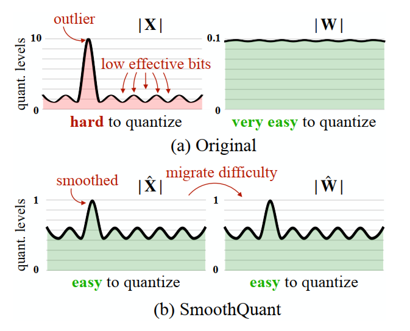
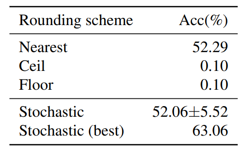
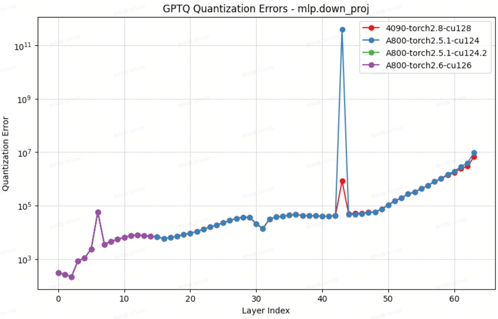
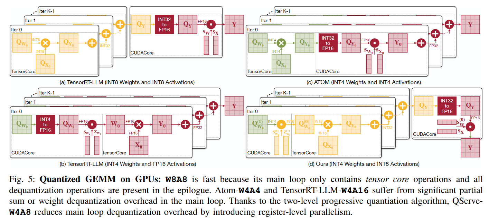
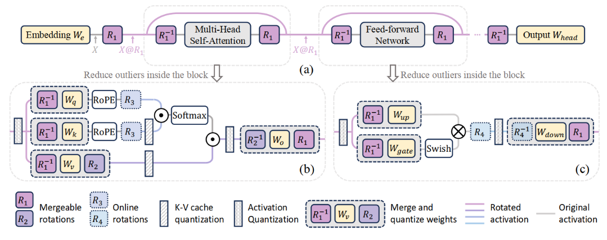
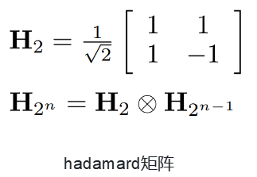

# 对象画像

对量化有初步了解但缺系统框架，主要诉求是工程落地：在既定推理框架（优先 vLLM）与目标硬件约束下，拿到可复现的量化配方（选型、校准、导出格式、kernel/后端适配、评测与回滚），并能解释质量/性能波动的原因。

# 大模型量化关键流程，踩坑经验
## 量化流程
量化过程可以分为以下两个阶段：
1. **pre-processing**： 在浮点域，对权重做变换，例如缩放、旋转等
2. **rouding**：将权重由浮点域舍入到整数域
目前，主流INT量化方法聚焦第一阶段，也有类似[TesseraQ](https://github.com/Intelligent-Computing-Lab-Panda/TesseraQ)等关注第二阶段的方法。

而对于FP量化，由于其ulp不固定， 因此rounding阶段可能需要更多的关注。

### pre-processing
本质上都是等效变换。例如，SmoothQuant的公式为：

$$
Y=XW=(Xdiag(s)^{-1}) \cdot (diag(s)W)=(XR^{-1}) \cdot (RW)
$$
若R为Hadamard矩阵，则该公式为QuaRot量化方法

<figure style="text-align:center;">
  
</figure>

### rouding
关注如何将浮点数值cast成整数，包含：
1. clamp：限制最大的数值，压缩动态范围，提高量化grid的精度。可以以MSE或KL-div为指标来选择clamp数值
2. rounding：将浮点数值舍入到整数域，四舍五入是MSE度量下的最优方法，但不一定是整个模型最优的舍入方法。一般通过训练的方式来找到最优的舍入方法。

<figure style="text-align:center;">
  
</figure>

## 踩坑经验
### 开发检查量化结果的脚本
只检查weight-name、dtype、shape、数值范围有时候就能发现很多问题

### 部署模型时，需要关注推理框架的log
vLLM/SGLang有可能打个warning，就自动fallback到其他的量化方法，而不是直接报错。
例如，A800机器无法推理NVFP4-W4A4，因此vLLM会自动fallback成NVFP4-W4A16

### 可视化量化损失，帮助debug
<figure style="text-align:center;">
  
</figure>

### 其他
1. 精度要求高的场景，建议使用cpu做dtype cast。例如：cuda对fp8的cast存在问题，168.1会cast成160，应当是176
2. 

# 量化框架相关，主流的框架以及涉及到的坑
| 框架 | 定位/特点 | 简单介绍 | 支持推理框架 | 使用注意/坑 |
| --- | --- | --- | --- | --- |
| [LightCompress](https://github.com/ModelTC/LightCompress) | 学术导向，覆盖面广 | 量化算法较多，但近期主要更新在剪枝，量化相关迭代偏少 | vLLM/SGLang/AutoAWQ | 文档更新滞后 |
| [llm-compressor](https://github.com/vllm-project/llm-compressor) | vLLM 官方量化工具 | 支持算法有限，更新节奏慢 | vLLM/SGLang | 量化效率与速度一般；高级量化需求可能需要二次开发 |
| [GPTQModel](https://github.com/ModelCloud/GPTQModel) | 只做权重量化，社区活跃 | 以 GPTQ 系列算法为主，集成常见模型与推理后端 | Transformers / vLLM | 对于非 GPTQ 或全量化场景支持不足 |
| [ModelOpt](https://github.com/NVIDIA/Model-Optimizer) | NVIDIA 官方量化工具链 | 强调高性能部署 | TensorRT-LLM | 需要适配才能用vLLM推理 |
| [neural-compressor](https://github.com/intel/neural-compressor) | Intel 官方量化/压缩工具 | 一些软件模拟的方法可以来这里找 | OpenVINO / ONNX Runtime / PyTorch |  |
| [bitsandbytes](https://github.com/bitsandbytes-foundation/bitsandbytes) | 训练/推理通用量化库，适配Huggingface | 8bit 与 4bit（含 QLoRA 常用配置） | Transformers / PEFT |  |

# 部署工具，后端推理技术，如何评测过程中的坑
## 性能分析
[Profiling vLLM](https://docs.vllm.ai/en/stable/contributing/profiling/#profile-with-pytorch-profiler)

## 模型高效推理
TP应当与模型大小/显存匹配，过大过小都会影响效率。

例如, 对于Qwen3-8B, 如果在8卡A800上部署, 推荐用TP1部署8个实例，这样总推理速度反而更快。而对于Qwen3-32B，则推荐TP4。

## 稳定评测
温度系数对thinking模型的精度有重大影响，因此thinking模型必须要用固定的温度系数。而采样过程会不可避免地增大实验结果复现难度。
此外，[Defeating Nondeterminism in LLM Inference](https://thinkingmachines.ai/blog/defeating-nondeterminism-in-llm-inference/)也提到，推理过程中浮点运算的非结合性也会导致计算结果的不同。

因此，在最新的[全量测试集](https://mx4lbik1jc.feishu.cn/wiki/St9fwFNB7i9XYgkkCP1c7vMynOb)中，我们对部分数量较小的数据集进行了倍增，并固定seed=42，以提高测试结果的稳定性。

条件允许的话，建议使用全量测试集进行测试。

# 大模型特定优化，经验分析以及踩坑
## MoE模型量化
经验上看，相比同参数量的Dense模型，MOE模型会比较好量化。

若出现长文能力（如GPQA/Code）下降，而短文能力（如CEval）不变，可以考虑不量化attn部分。

## 长上下文量化

没有做过

## 多模态对齐量化

## 大&小模型量化

越小的模型，weight越难量化；越大的模型，activation越难量化。

但weight通常没有结构性pattern，因此非常难以解决。

而80B以上的模型，per-token或更细粒度的量化是很有效的方法。大模型量化的困难主要在于工程上，例如量化效率，资源占用等

## 如何选择合适的推理框架（Vllm, Sglang, TensorRT-LLM）？有没有基本准则？

| 框架 | 侧重点 | 上手难度 | 模型支持 | 调度/工程特性 |
| --- | --- | --- | --- | --- |
| TRT-LLM | 极致性能、企业级场景 | 高 | 依赖 NVIDIA 生态 | 性能最优但流程复杂 |
| vLLM | 学术/工程通用 | 低 | 模型覆盖更广 | 吞吐与易用性均衡 |
| SGLang | 学术/工程通用 | 低 | 模型覆盖较少 | 调度效率高、代码量少 |

**考虑到芯片部门选择了vLLM作为推理框架，因此也建议后续量化工作优先选择vLLM作为推理框架。**

### 量化框架和推理框架之间的依赖关系是怎样的？

基本没有依赖

## 算法选型
### GPTQ / AWQ / SmoothQuant 适用场景对比、参数解释及调优心得
| 方法 | 适用场景/组合建议 |
| --- | --- |
| GPTQ | 适合与旋转方法配合 |
| AWQ | 适合 WNA16 场景 |
| SmoothQuant | 仅在 NVFP4 量化中有优势 |

**目前INT量化的最优方案**：OSTQuant + GPTQv2。OSTQuant后续有一些改进的工作，建议对比测试。
**目前NVFP4量化的最优方案**：SmoothQuant + GPTQv2

### 量化粒度一般选择哪种: per tensor/per channel/per token？
首先明确：per-channel是指weight量化；per-token是指token量化

llm中，由于activation分布重尾，per-token是最好选择。

小模型的量化更为困难，per-channel/token的粒度可能不够，可以尝试类似[QSserve](https://arxiv.org/abs/2405.04532)的思路，通过二级量化来逼近per-group量化，同时避免推理速度下降

<figure style="text-align:center;">
  
</figure>
## 基于1~2个经典模型（比如Qwen3-VL，DeepSeek R1) 的量化全流程的实战分享（介绍关键流程）？

## DeepSeek-R1

[DeepSeek-R1量化报告](https://mx4lbik1jc.feishu.cn/wiki/PrQZwdj2hiU4TskDjgDcGx8Pnoe)

只需要quarot即可。

**为什么不用GPTQ？**

- 资源不足：1T内存+8xA800做data-free的量化已经是极限了
- 速度不行：每个expert因为输入不同，都要单独做一次GPTQ

###  何时只做权重量化，何时做全量化？有没有基本准则？
从精度上考虑：W4A16/W8A8均可以轻松达到无损的精度。因此，要不要做activation的量化，主要看推理侧。

若像x6000这种，浮点算力不足，则考虑A8；而若推理时负载不高，是memory-bound，则考虑A16。

### 关于混合精度量化有没有什么经验？一般来说，哪些层需要保留原始精度？

按不同层，考虑量化的顺序：
1. routed-experts/gate/mlp
2. shared-experts
3. attn.o_proj
4. attn.qkv_proj
5. lm_head/embedding

按不同block：没有充分的结论，按经验，优先考虑给后面的block以更高的精度。

一个tensor内做混合精度，参考[ARCQuant](https://arxiv.org/abs/2601.07475)

### 对于不同的模型，不同的量化方法？
目前没有自动选择的方法

### 模型评测过程能否全部模块化，比如通过工作流的方式？
详见[LLM Benchmark 评估工作流设计文档](https://mx4lbik1jc.feishu.cn/wiki/St9fwFNB7i9XYgkkCP1c7vMynOb)

### 量化方法中的scale/zero offset一般指什么？怎么存储的？Q/DQ的显示量化是怎么做推理的？这种格式和vllm compressor的产物有什么不同？
scale/zero用于将原本位于浮点域的数值映射到整数域，具体公式为：
- quant：`q = round(x / scale) + zero_point`，
- dequant：`x_hat = (q - zero_point) * scale`

存储方式见：[量化 survey](https://mx4lbik1jc.feishu.cn/wiki/OHfpwaOcaiMv93kLZX9cHFsqnQg)

正常的 forward：
$$
Y = X \cdot W^{T}
$$

qdq forward是先对X和W做量化反量化，再用fp16等高精度数值类型做实际运算：
$$
Y = \mathrm{dq}(\mathrm{q}(X)) \cdot \mathrm{dq}(\mathrm{q}(W^{T}))
$$

这种格式属于fake-quant，而llm-compressor的产物是real-quant，存在微小的数值偏差。
一般的量化方法对fake/real quant并不敏感，二者的推理结果没有差异。部分需要训练的量化方法（例如tesseraq）对该过程较为敏感。
加上real-quant推理效率更快，建议优先使用real-quant。

1.  w4a16或是w8a8的格式需要魔改vllm的内容，魔改的内容和推理执行的kernel内核有关系吗？
  - 相关，核心在于 kernel 是否支持对应的权重布局与激活精度
  - 常见改动点：权重打包、算子融合、量化/反量化位置

### 量化结果中除了模型还有config、tokenizer等内容，这些是做什么的？怎么在推理的时候使用的？
config、tokenizer是huggingface格式模型的一部分，不是量化独有的。
一般会将量化的配置写在`config.json`中，便于vLLM选择正确的推理方法，或保留一些metadata以便后续分析。

### 对常用的基于Dit的扩散模型如文生视频Wan2.1及CogVideoX量化，有啥具体算法及注意事项？

   